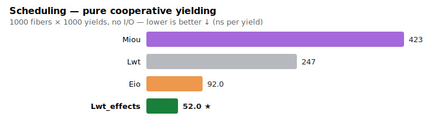
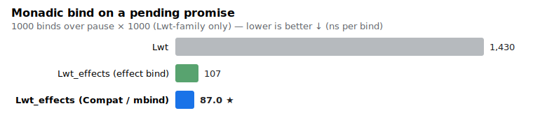
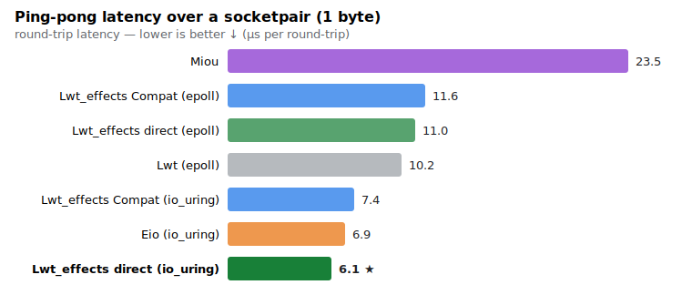
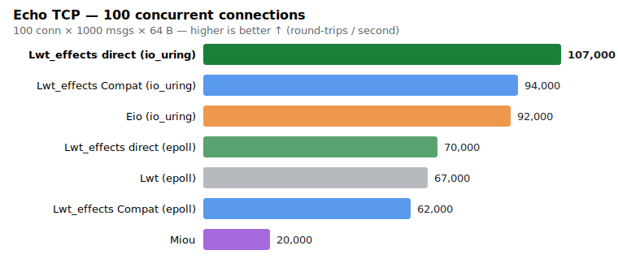
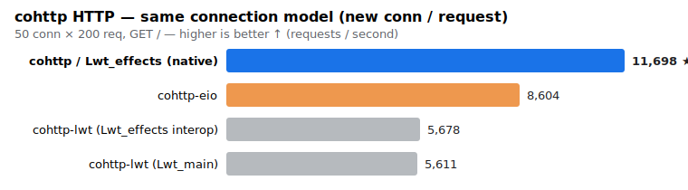

# Lwt with effects — an experiment, and benchmarks

This repository holds the benchmarks for an **experimental effect-based scheduler
for [Lwt](https://github.com/ocsigen/lwt)**, built on OCaml 5 algebraic effects.
It is compared against classic Lwt, [Eio](https://github.com/ocaml-multicore/eio)
and [Miou](https://github.com/robur-coop/miou).

The scheduler itself (`lwt_effects` and `lwt_effects_uring`) lives on the
[`lwt-effects-poc` branch of ocsigen/lwt](https://github.com/ocsigen/lwt/tree/lwt-effects-poc),
under [`src/effects/`](https://github.com/ocsigen/lwt/tree/lwt-effects-poc/src/effects).

> ⚠️ This is a **proof of concept / research experiment**, not a release. The
> numbers below are micro-benchmarks on a single machine; read the
> [limitations](#how-to-read-these--and-the-limitations) before drawing
> conclusions.

## Why?

Effect-based IO libraries (Eio, Miou) are fast, but **direct-style**: a function
that may block looks like any other in its type. Lwt is **monadic**: a function
that may block returns `_ Lwt.t`, so asynchronicity is visible in the type — and
the implicit concurrency of `bind` (`both (a >>= f) (b >>= g)` runs both
branches) is part of why huge codebases (Ocsigen, Eliom, MirageOS…) rely on it.

The question: **can we get effect-library performance while keeping Lwt's
monadic API, its async types, and its semantics?**

We reimplemented Lwt's core on effects and measured. Two binds emerged:

| bind | how | concurrency | cost |
|---|---|---|---|
| `bind` (effect) | suspends the fiber (direct style under the hood) | explicit (`async`) | cheap, but **changes Lwt semantics** |
| **`mbind` / `Compat`** | non-blocking (allocates a promise + callback) | **implicit, like Lwt** | allocates like Lwt, **minus the proxy machinery** |

`Compat` is the drop-in: same monadic API, same `+'a t` (covariant), same
implicit concurrency. The IO can run on **epoll** (via `Lwt_engine`) or on
**io_uring** (via `lwt_effects_uring`).

## The versions compared

- **Lwt** — classic, unchanged.
- **Lwt_effects (direct)** — the effect bind + `await`. Fastest, but loses the
  async type / changes concurrency. Eio-like.
- **Lwt_effects (Compat)** — the monadic, drop-in model: `_ t`, `>>=`, implicit
  concurrency preserved.
- each of the two, on **epoll** or **io_uring**.
- **Eio** (`eio_linux`, io_uring) and **Miou** for reference.

## The benchmarks

| # | workload | what it stresses |
|---|---|---|
| 1 | 1000 fibers × 1000 yields | pure cooperative scheduling (no IO) |
| 2 | chain of 1000 binds over `pause` | monadic bind cost (Lwt-family) |
| 3 | ping-pong over a socketpair, 1 B…256 KB | IO latency |
| 4 | echo TCP, 100 concurrent connections | IO under concurrency |
| 5 | cohttp `GET /`, same connection model | a real HTTP stack |

## Results

### 1. Scheduling (no IO)



The effect scheduler resumes a fiber by re-enqueueing a continuation in an
array-based ring buffer — no promise, no callback-list walk. It is **~4.7×
faster than Lwt and ~1.7× faster than Eio**, with the lowest allocation
(8 words/yield vs 67 for Lwt). This is where effects shine: reactive /
scheduling-heavy code (React_lwt, update cycles, multi-tier round-trips).

### 2. Monadic bind on a pending promise



Classic Lwt's pending `bind` builds a fresh promise, a callback closure and
proxy bookkeeping, and is driven by `Lwt_main`'s loop. Our `Compat` bind
allocates a promise + a callback too — **but no proxy machinery** — and runs on
the lean ring-buffer scheduler: **~15× faster, while preserving Lwt's
semantics** (implicit concurrency). The effect bind is in the same ballpark but
changes semantics.

### 3. Ping-pong latency (1-byte payload)



I/O latency is dominated by syscalls and the event loop, so on **epoll** all of
Lwt / Lwt_effects are within ~10 % of each other. The win comes from
**io_uring**: `Lwt_effects` (direct) is the fastest, and `Compat` over io_uring
— *monadic, async-typed, implicit-concurrency-preserving* — beats Lwt and is on
par with Eio. (Miou is slower here; see limitations.)

### 4. Echo TCP, 100 concurrent connections



Same story under concurrency: io_uring backends lead (Lwt_effects direct >
Lwt_effects Compat ≈ Eio), epoll backends cluster around classic Lwt.

### 5. cohttp — a real HTTP stack



Four ways to run the same `GET /` workload, all at the **same connection model**
(new connection per request) so the bars are comparable:

| label in the chart | what actually runs |
|---|---|
| **cohttp / Lwt_effects (native)** | cohttp's request/response **codecs** run directly on the effect scheduler, through a hand-written `Cohttp.S.IO` backend (`Le_cohttp`) on `Lwt_effects` I/O. No Lwt involved. Keeps the `_ t` async type. |
| **cohttp-eio** | the upstream `cohttp-eio` library (codecs + `Client`) on Eio / io_uring. |
| **cohttp-lwt (Lwt_effects interop)** | the **unmodified** `cohttp-lwt-unix` library, run *under* our scheduler via the Lwt interop. The cohttp code is still plain Lwt; our scheduler only pumps Lwt's loop. |
| **cohttp-lwt (Lwt_main)** | the same `cohttp-lwt-unix`, on stock `Lwt_main`. The baseline. |

cohttp's *core* (`cohttp`) is functorised over an IO monad. Thanks to making
`Lwt_effects.t` covariant (`+'a t`), we could instantiate those codecs on a
`Lwt_effects` IO backend — **cohttp's codecs run natively on the effect
scheduler**. That native path is **~2× cohttp-lwt and ~1.4× cohttp-eio**; with
HTTP keep-alive it reaches ~40k (epoll) / ~47k (io_uring) req/s.

The two `cohttp-lwt` bars are nearly identical (≈ 5.6k): running existing
cohttp-lwt *under* our scheduler via the interop gives **compatibility, not
speed** — the Lwt code still runs on Lwt's own bind/promise/`Lwt_unix` machinery,
so it benefits from neither cheap scheduling nor io_uring. The speed-up requires
*using* the effect primitives (the native path) or replacing Lwt's core.

> ⚠️ The "native" bar is **not a full cohttp `Client`/`Server`** — it's cohttp's
> codecs driven by a minimal hand-written loop. A usable `cohttp-lwt_effects`
> library (Server/Body/Client, io_uring zero-copy buffers, timeouts/cancellation)
> remains to be built; see the
> [limitations](#how-to-read-these--and-the-limitations) below. The bar shows
> *"cohttp codecs run efficiently on the effect scheduler"*, not a shipped stack.

## How to read these — and the limitations

- **Lower is better** for charts 1–3 (latency); **higher is better** for 4–5
  (throughput). The ★ marks the best in each chart.
- **Micro-benchmarks, one machine.** There is real run-to-run variance (machine
  load); treat differences under ~10 % as noise. Absolute numbers are not
  portable; the **ratios and rankings** are the point.
- **In-process client + server** for the IO/HTTP benchmarks (loopback). No
  network, no real backpressure, no TLS — a loopback socketpair/TCP is best-case.
- **Miou** is penalised on these single-domain latency/concurrency workloads: it
  issues ~8 `ppoll` per round-trip where Lwt/Eio issue ~2. Miou targets other
  strengths (multi-domain parallelism, simplicity, availability guarantees); this
  is **not** a verdict on Miou.
- **cohttp comparison caveat:** the native client is a minimal hand-written loop
  reusing cohttp's request/response codecs, while cohttp-lwt/eio use their full
  `Client`. The *server* uses cohttp's codecs in all cases. So the cohttp chart
  shows "cohttp codecs run efficiently on the effect scheduler", not a perfectly
  matched client-for-client race.
- **flambda** was tried: it does **not** produce a zero-allocation fast path (the
  monadic continuation closure is inherent), it mostly helps *classic Lwt* by
  inlining its bind machinery, and it is negligible on IO/scheduling. Rankings
  unchanged.
- The effect bind (`Lwt_effects direct`) is **not** semantically equal to Lwt:
  `both (a >>= f) (b >>= g)` serialises. Only `Compat`/`mbind` preserves Lwt's
  implicit concurrency — that is the row to compare to Lwt.

## Takeaway

A monadic, drop-in `Compat` core (semantics + async types of Lwt preserved) is
**competitive-to-faster than classic Lwt everywhere** — dramatically so on
scheduling/bind-heavy code — and, on io_uring, matches or beats Eio. The cost of
keeping Lwt's semantics over the bare effect scheduler is real but modest; the
cost of *not* keeping them (direct style) is losing the typing that makes Lwt
valuable.

## Reproduce

`lwt_effects` / `lwt_effects_uring` are built from source as a vendored checkout:

```sh
ln -s /path/to/lwt vendor/lwt           # the lwt-effects-poc branch checkout
opam install eio eio_main miou cstruct uring   # in a 5.x switch
dune exec --profile release pingpong/bench.exe
dune exec --profile release scheduling/bench.exe
dune exec --profile release echo/bench.exe
# cohttp benches: see the cohttp/ directory (separate dune-project)
python3 charts/gen_charts.py            # regenerate the SVGs from the data
```

Linux only (io_uring). The chart data lives in `charts/gen_charts.py`.
