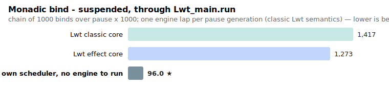
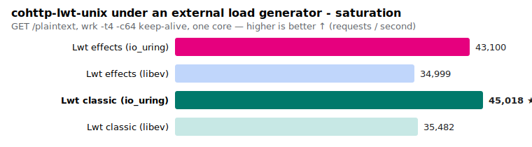
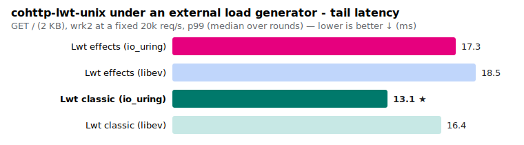
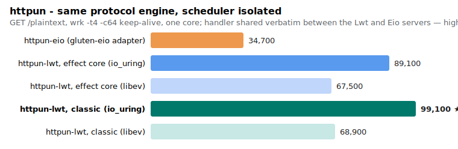

# Lwt on io_uring and effects — keeping the monad at direct-style speed

[Lwt](https://github.com/ocsigen/lwt) is the concurrency library a large part
of the OCaml ecosystem is built on — Ocsigen/Eliom, MirageOS, cohttp, and
twenty years of application code. It is **monadic**: a function that may
suspend returns an `'a Lwt.t`, so asynchrony is visible in its type.

OCaml 5 brought effect handlers, and with them a new generation of
**direct-style** I/O libraries — [Eio](https://github.com/ocaml-multicore/eio),
[Miou](https://github.com/robur-coop/miou) — with excellent performance. In
direct style, a function that may suspend looks like any other function.
That is pleasant to write, but it gives up something we care about:

- **Knowing, from the type, which calls can suspend.** In reactive
  programming (React/`Lwt_react`-style update propagation) and in
  **multi-tier programming** (Eliom's client/server tierless code), whether
  an expression can yield to the scheduler is semantically important —
  an invisible suspension point in the middle of an update cycle or of a
  shared client/server section is a bug you cannot see. Until OCaml has
  **typed effects**, the monad *is* the type discipline for suspension.
- **Implicit concurrency**: in Lwt, `both (a >>= f) (b >>= g)` runs both
  branches concurrently without any fork annotation. Large codebases rely
  on this semantics.
- **The ecosystem itself**: millions of lines compiled against `'a Lwt.t`.
  A migration to a new API is a cost most projects will never pay.

So the question this repository answers with benchmarks:

> **Can Lwt keep its API, its types and its semantics — and reach the
> performance of the effect-based, direct-style libraries?**

The answer is yes, in two independently useful layers:

1. **A transparent io_uring engine** for Lwt
   ([`lwt-uring`](https://github.com/ocsigen/lwt/tree/lwt-uring)): a new
   `Lwt_engine` backend; existing programs switch to io_uring with one line
   (or a default), no other change.
2. **A reimplementation of Lwt's core on OCaml 5 effects**
   ([`lwt-effects-core`](https://github.com/ocsigen/lwt/tree/lwt-effects-core)):
   `src/core/lwt.ml` rewritten over effect handlers, behind the **unchanged**
   `lwt.mli`. A true drop-in: the whole historical test suite passes
   natively (`test/core` 705 tests, `test/unix` 233, the ppx, `Lwt_react`,
   `Lwt_direct`, `lwt_uring` suites), and the unmodified ecosystem
   recompiles and runs — cohttp-lwt-unix, ocsigenserver, Eliom,
   Ocsigen Start.

**Headline results** (details and methodology below):

- **io_uring is the big I/O win**: on real HTTP serving, switching the
  engine under unchanged code raises saturation throughput by **+27 %**
  (cohttp) to **+44 %** (httpun), and cuts small-message round-trip latency
  from 9.9 to 7.4 µs.
- **The effect core makes the monad itself cheaper**: an already-resolved
  `bind` — the hot path of monadic code — costs **5.2 ns instead of 11
  (~2×), with a third of the allocation**; cooperative scheduling is at
  parity to ~8 % faster; an unmodified cohttp server gains **+7 %**; and the
  effect core has the **best GC-pause profile** of everything measured
  (max 1.0 ms under full load, vs 1.7 ms for the classic core).
- **Against Eio, scheduler for scheduler, unchanged Lwt code on io_uring is
  at Eio level**: a statistical tie on the echo and ping-pong I/O
  benchmarks, and the opt-in direct style (`Lwt_direct`, on the effect
  core's own run queue) is **faster than Eio at pure scheduling**
  (69–76 vs 83–93 ns/yield, 16 vs 40 words). Where an Eio-based stack beats
  an Lwt-based stack (cohttp-eio vs cohttp-lwt, ~5–9 %), holding the HTTP
  engine constant (httpun) shows the difference is the *stack*, not the
  scheduler.
- **Interestingly, the "cost of effects" is zero for monadic code**: a
  `perf` profile of the effect core serving HTTP shows the OCaml 5 effect
  primitives (`perform`, stack switching, `continue`) at 0.00 % of samples.
  Monadic `bind` never suspends a fiber; effects structure the scheduler
  and enable the direct style, and you pay for them only when you use them.

The earlier proof-of-concept report (separate `lwt_effects` package, two
bind flavours) is preserved in
[README-2026-06-poc.md](README-2026-06-poc.md).

> ⚠️ All numbers: micro-benchmarks and loopback I/O on one laptop
> (Intel i7-9750H, Linux 6.17, OCaml 5.4.0 without flambda). Treat
> differences under 10 % as noise; prefer ratios to absolutes. The
> [methodology section](#how-we-measured-methodology) describes the
> protocol that makes these numbers reproducible.

## What we built

### Layer 1 — the transparent io_uring engine

Lwt's event loop is pluggable (`Lwt_engine`): historically select, poll or
libev (epoll). `lwt_uring` adds an io_uring backend behind the same
interface. Readiness-based I/O keeps working unchanged; on top of it, the
engine routes a growing set of operations through the ring as *completions*
(reads, writes, connect, accept), batching submissions and avoiding
syscall-per-operation. Because it is just another engine, **every existing
Lwt program benefits without recompiling anything but the engine choice**.

Two refinements that matter under connection churn:

- **Multishot accept** (`IORING_ACCEPT_MULTISHOT`): one submission per
  listening socket, one completion per accepted connection — no accept(2)
  and no fcntl per connection. (Requires a patched ocaml-uring until the
  feature is upstream.) In a new-connection micro-benchmark this took
  accept throughput from 17.4k conn/s (libev) to 21.7k.
- **`Lwt_unix.getaddrinfo` numeric fast path**: a numeric host and port
  resolve synchronously (`AI_NUMERICHOST`) — no DNS, no worker-pool job.

### Layer 2 — the effect-based core

`src/core/lwt.ml` reimplemented over OCaml 5 effects, behind the unchanged
`lwt.mli`. The key design decisions:

- **`bind` stays non-suspending.** A pending `bind` allocates one lean
  promise and one callback — like Lwt, *minus* Lwt's proxy machinery — and
  preserves implicit concurrency. (An effect-based *suspending* bind was
  prototyped and measured: it is not faster, and it silently changes Lwt's
  semantics. It is not the default and never will be.)
- **Effects structure the scheduler.** The run queue is an array ring
  buffer; resuming a suspended computation is a queue push/pop, with the
  continuation stored unboxed (no closure per resumption). Monadic code
  runs in a single fiber and never performs an effect; fibers and
  suspensions are paid for only by code that opts into direct style.
- **Direct style as an opt-in, not a replacement**: `Lwt_direct` (a
  `spawn`/`await` interface over the same scheduler) gives Eio-style code
  *inside* an Lwt program, on the core's own run queue — and it benchmarks
  faster than Eio.
- **Promise internals tuned for the long haul**: proxy links are
  reverse-merged so tail-recursive bind loops are O(1) in live memory
  (measured flat over 2M iterations); link chases are path-compressed;
  promises attached to *several* sources (`choose`/`pick` and the
  cancellation mirrors) install **removable** waiters that detach from the
  losers as soon as one source resolves — on a long-lived promise (a
  server's shutdown promise, one `pick` per connection, as conduit does)
  this is what keeps memory flat over hours. We validate it under load:
  the live set, sampled after a full major GC during a sustained run, stays
  constant.
- **Classic loop semantics are preserved to the letter**, including the
  interleaving of `Lwt.pause` with the I/O engine: each pause generation
  yields to one engine iteration, exactly like the historical `Lwt_main`
  lap, so a pause loop can never starve I/O. (This is visible in one
  micro-benchmark below: a serial chain of pauses is dominated by that
  engine lap on *both* cores — the cost is the semantics, not the
  implementation.)

A third configuration appears in some charts: **lab**
([`lwt-effects-lab`](https://github.com/ocsigen/lwt/tree/lwt-effects-lab)),
the *semantics-breaking* experiments (suspending bind, direct style on a
private ring, no `Lwt_unix`). It is the "how fast could it go if we gave up
Lwt's semantics and API" ceiling — kept experimental, deliberately not what
ships. Its main lesson: the ceiling is close (e.g. echo 108k vs 95k rt/s),
and on `bind` the semantics-breaking version is *not* faster.

## What is being compared

The drop-in property makes the methodology simple: **every Lwt
configuration is the same benchmark source, public Lwt API only** — what
changes is which lwt is linked:

| label | lwt |
|---|---|
| `classic` | the [`lwt-uring` branch](https://github.com/ocsigen/lwt/tree/lwt-uring): historical core + the transparent io_uring engine |
| `effects` | the [`lwt-effects-core` branch](https://github.com/ocsigen/lwt/tree/lwt-effects-core): effect-based core + the same engine |

**Eio** (`eio_main` 1.3, io_uring via `eio_linux`) and **Miou** (0.6,
`miou.unix`, which multiplexes with `ppoll` on this machine) are the
external references.

**Chart colour code**: colour = scheduler family — **blue** = effect core
(vivid for io_uring, light for epoll), **blue-green** = classic core (dark
for io_uring, light for epoll), **dark blue-grey** = lab; orange = Eio
(io_uring); purple = Miou (ppoll). The vivid-blue bar (effect core +
io_uring) is the configuration this work ships.

## The benchmarks, why they are relevant, and the results

The suite covers the stack bottom-up: the cost of the monad itself (bind),
of the scheduler (yields), of single-connection I/O (ping-pong), of
concurrent I/O (echo), then two real HTTP stacks under a real load
generator. Each level catches what the previous one cannot.

### 1. Monadic bind — the cost of every `>>=`




| chain of binds (ns/op, words/op) | classic core | effect core | lab (breaking) |
|---|---|---|---|
| resolved (`bind (return v) f`) | 10.6–11.4 / 25 | **5.1–5.2 / 9** (~2×) | 9.5 / 9 |
| suspended (`bind (pause ()) f`, through `Lwt_main.run`) | 1404–1430 / 88 | **1262–1284 / 71** (~10 %) | 96 / 52 |

The resolved row is the common case of hot monadic code — every
already-resolved `>>=` in every Lwt program. The historical bind's
promise + callback + proxy bookkeeping becomes one lean promise: **~2×
faster, a third of the allocation**. Note the lab column: breaking Lwt's
semantics buys *nothing* on bind.

The suspended row measures a *serial* chain of `pause`s through the full
main loop. Lwt's semantics make each pause generation interleave with one
I/O-engine iteration (so pause loops cannot starve I/O); that engine lap
(~1.3 µs of libev) dominates the figure on **both** cores — the effect
core's leaner machinery shows as ~10 % and 17 fewer words. The lab column
shows what a scheduler with no engine to honour measures; the *pause storm*
below shows the batched picture, where one lap is amortized over a thousand
resumptions.

Also not visible per-op: tail-recursive bind loops are O(1) in live memory
on the effect core (reverse-merged proxies, measured flat over 2M steps).

### 2. Scheduling — pure cooperative yielding


Why it matters: reactive code (`Lwt_react` update cycles), pause storms,
multi-tier round-trips — workloads that are scheduler-bound, not I/O-bound.

| 1000 fibers × 1000 yields | ns/yield | words/yield |
|---|---|---|
| lab: breaking direct yield | 59 | 9 |
| **Lwt_direct (effect core)** | **69–76** | **16** |
| Eio | 83–93 | 40 |
| Lwt_direct (classic core) | 132–156 | 18 |
| Lwt (effect core, `pause`) | 222–237 | 61 |
| Lwt (classic core, `pause`) | 234–255 | 67 |
| Miou | 416–436 | 67 |

The monadic `pause` storm is at parity to ~8 % faster on the effect core
(both cores pay one engine lap per pause generation, amortized here over
the 1000-fiber batch). The headline is direct style: **`Lwt_direct` on the
effect core's run queue is faster than Eio**, with the lowest allocation of
the table — a yield is one ring-buffer push/pop.

### 3. Ping-pong — single-connection I/O latency


µs per round-trip over a socketpair, min over alternating runs ("bigarray"
= the `Lwt_bytes`/`Lwt_io` path, which `Lwt_io` and cohttp actually use):

| config | 1 B | 64 B | 1 KB | 16 KB | 256 KB |
|---|---|---|---|---|---|
| Lwt bigarray (classic, epoll) | 9.9 | 10.0 | 10.0 | 13.5 | 96.6 |
| Lwt bigarray (effects, epoll) | 9.6 | 9.6 | 9.7 | 13.1 | 99.5 |
| Lwt bigarray (classic, io_uring) | 7.4 | 7.0 | 7.5 | 10.8 | 78.8 |
| Lwt bigarray (effects, io_uring) | 7.3 | 6.8 | 7.1 | 10.6 | **75.2** |
| Eio (io_uring) | **6.4** | **6.6** | **6.4** | **9.8** | 76.4 |
| lab: breaking + own ring | 6.1 | — | — | — | — |
| Miou | 22.8 | 22.4 | 23.3 | 26.7 | 170.3 |

io_uring is worth ~2.5 µs per round-trip to Lwt at every size. Against Eio
it is effectively a three-way tie: Eio keeps a small edge (≲1 µs) at the
smallest payloads, the gap closes by 16 KB, and the effect core is the
fastest of the table at 256 KB — unchanged Lwt code *at Eio level*.

### 4. Echo — 100 concurrent connections


Why it matters: the scheduler and the engine under concurrent I/O pressure,
without any HTTP stack in the way.

(Ranges over interleaved rounds; Eio is measured inside each binary run, so
it has samples in the same windows.)

| config | round-trips/s |
|---|---|
| lab: breaking + own ring | **108 037** |
| Eio (io_uring) | 92.2k – 99.6k |
| Lwt (effect core, io_uring) | 92.3k – 98.7k |
| Lwt (classic core, io_uring) | 90.4k – 94.8k |
| Lwt (effect core, epoll) | 69.3k – 71.6k |
| Lwt (classic core, epoll) | 69.2k – 73.3k |
| Miou (ppoll) | 20.8k – 22.1k |

**The three io_uring rows are a statistical tie** — unchanged Lwt code on
the transparent engine is at Eio level. epoll → io_uring is worth ~+30 %
here. For calibration, the lab's private-ring configurations re-measured in
the same windows: `Compat` + own ring 94.2k (≈ the transparent engine),
direct style + own ring 108k — the remaining direct-style margin is the
semantics trade the drop-in declines to make.

### 5. cohttp — an unmodified, real HTTP stack


The same `cohttp-lwt-unix` 6.2.1, **untouched**, recompiled against each
core (opam pin), `Client.get`, new connection per request (best of 3
interleaved rounds; this benchmark has the largest run-to-run variance):

| config | classic | effect core |
|---|---|---|
| epoll | 6 105 | **6 557** (+7 %) |
| epoll + static resolver | 6 560 | **6 803** |
| io_uring (+ multishot accept on the effect core) | 6 964 | **7 486** (+7 %) |
| io_uring + static resolver | 7 671 | **8 174** (+7 %) |
| cohttp-eio | | 8 495 – 8 964 |

This is where the per-connection optimisations show (see
[the optimisations](#the-optimisations-and-what-each-bought)): syscall
accounting found ~13 syscalls and ~4 worker-pool round-trips per request in
the connection lifecycle, and three of them could be removed. The remaining
~5–9 % to cohttp-eio is the stack itself (an `Lwt_io` buffered channel pair
per connection, conduit, older parsing) plus the client-side socket setup —
and it is the stack, not the scheduler, as §7 demonstrates directly.

### 6. Realistic HTTP — external load generator, latency percentiles




Why it matters: in-process micro-benchmarks cannot see serving-pipeline
behaviour — arrival batching, fairness across connections, GC pauses under
steady load, memory behaviour over minutes. We reproduced two existing
methodologies as faithfully as possible (server sources verbatim from the
upstream repositories), with wrk2 over real TCP:

- **[ocaml-multicore/retro-httpaf-bench](https://github.com/ocaml-multicore/retro-httpaf-bench)**:
  `GET /` with a ~2 KB body, wrk2 at *fixed rates* with latency
  percentiles, scaled to one laptop core (`-t 4 -c 100`, rates 5k/10k/20k).
- **[robur-coop/httpcats bench protocol](https://github.com/robur-coop/httpcats/tree/main/bench)**:
  `GET /plaintext`, wrk at saturation, repeated runs; their Miou server
  run with `DOMAINS=1` for a single-core comparison.

| config | saturation (req/s, /plaintext) | p99 @5k | p99 @10k | p99 @20k |
|---|---|---|---|---|
| cohttp-eio | **68–82k** | **4.0 ms** | **4.6 ms** | 8.5 ms |
| cohttp-lwt, classic (io_uring) | 45.0k | 5.9 ms | 10.6 ms | 13.1 ms |
| cohttp-lwt, effect core (io_uring) | 43.1k (−4.3 %) | 5.5 ms | 11.6 ms | 17.3 ms |
| cohttp-lwt, classic (libev) | 35.5k | 4.9 ms | 9.5 ms | 16.4 ms |
| cohttp-lwt, effect core (libev) | 35.0k (−1.4 %) | 6.2 ms | 11.4 ms | 18.5 ms |
| httpcats (Miou, 1 domain) | 32.6k | 8.1 ms | 7.8 ms | **5.2 ms** |

Findings:

1. The transparent io_uring engine is worth **+27 %** to Lwt at saturation
   (35.5k → 45.0k) — its largest win on this stack, on unchanged code.
2. The two Lwt cores are at **latency parity at every rate** (in a
   dedicated interleaved A/B at 20k, median p99 came out 16.99 ms effect vs
   17.05 ms classic), and within noise of each other at saturation.
3. Under `olly`, the effect core has the **best GC-pause profile** measured
   here: max 1.0 ms under full load (classic: 1.7 ms).
4. httpcats/Miou has the most *stable* latency of the table at modest
   throughput — consistent with its bench report's fairness claims;
   cohttp-eio dominates this table on both axes. **Read that dominance for
   what it is: a comparison of HTTP *stacks***, settled next.

### 7. httpun — the same protocol engine on every scheduler



**httpun** (the maintained httpaf fork) has a single, scheduler-agnostic
protocol engine (angstrom parser, faraday serializer, a CPS state machine);
its per-scheduler adapters are thin Gluten I/O pumps with the *same*
request-handler signature. Our two servers share their handler **verbatim**
([`httpun_handler.ml`](http/httpun_handler.ml)) — unlike cohttp-lwt vs
cohttp-eio, this pair holds the HTTP stack constant. wrk keeps connections
alive, so this measures *per-request* cost (connection setup amortized) —
complementary to the connection-per-request cohttp tables.

| config | saturation (req/s) | p99 @20k req/s |
|---|---|---|
| httpun-lwt, classic (io_uring) | **98.0k – 100.2k** | 8.4 – 22.5 ms |
| httpun-lwt, effect core (io_uring) | 82.0k – 96.3k | **10.0 – 10.4 ms** |
| httpun-lwt, classic (libev) | 68.6k – 69.2k | 8.2 – 10.3 ms |
| httpun-lwt, effect core (libev) | 61.1k – 73.9k | 9.4 – 10.5 ms |
| httpun-eio (gluten-eio) | 34.5k – 34.8k | 15.6 – 18.8 ms |

What it shows:

- **Swap the stack and the picture inverts: unchanged Lwt code at ~100k
  req/s is ~3× httpun-eio and ~2.2× the cohttp-lwt stack** at saturation,
  same machine, same protocol. The cohttp table's "Eio dominance" is the
  *stack*, definitively.
- A fairness caveat in the other direction: httpun-eio's 34.7k says less
  about the Eio *scheduler* than about the off-the-shelf **gluten-eio
  adapter** (cohttp-eio reaches 75k on this very protocol). Adapter quality
  is a real variable even at constant engine — and the mature, hand-tuned
  adapter is the Lwt one.
- io_uring again: **+44 %** over libev on this lean stack (the leaner the
  stack, the more the engine shows).
- The two Lwt cores: effect-core saturation within 0–16 % of classic
  (overlapping in half the rounds; the spread is thermal), and the **most
  stable tail of the table** (p99 10.0–10.4 ms across rounds, while
  classic swung 8.4–22.5 ms).

## The optimisations, and what each bought

| optimisation | layer | benefit |
|---|---|---|
| io_uring engine (transparent) | engine | **+27–44 %** HTTP saturation, −2.5 µs/round-trip, on unchanged code — the single biggest win |
| multishot accept | engine | accept path: 17.4k → 21.7k conn/s; removes accept(2)+fcntl per connection |
| `getaddrinfo` numeric fast path | Lwt_unix | removes a DNS/worker-pool round-trip per numeric-host connection (conduit does one per request) |
| static service resolver | client config | removes a `getservbyname` worker-pool job per request; helps both cores (+5–10 % on cohttp) |
| lean promises, no proxy machinery on bind | effect core | resolved bind ~2× faster, 9 words vs 25 |
| ring-buffer run queue, unboxed resumptions | effect core | scheduling parity-to-+8 %; `Lwt_direct` 69–76 ns/yield (faster than Eio) |
| reverse-merged proxies + path compression | effect core | tail-recursive bind loops O(1) live memory (flat over 2M steps) |
| removable waiters on `choose`/`pick`/mirrors | effect core | flat memory on long-lived promises under per-connection `pick` (conduit's pattern); required for long-running servers, and worth +7 % on cohttp serving |
| `Lwt_direct` on the core run queue | effect core | direct style 132–156 → 69–76 ns/yield |

And one anti-result worth recording: routing `close(2)` through the ring
(`IORING_OP_CLOSE`) measured *slower* than the worker pool (which performs
closes on another core, in parallel with the event loop) and was rejected;
the negative result is documented in a comment in `lwt_unix`.

## How we measured (methodology)

The numbers above survived a protocol that earlier, sloppier measurements
did not. What ended up mattering:

**Benchmark protocol.**

- **One binary per configuration, saved, then runs alternated in the same
  machine window.** Sequential passes (all of A, then all of B) under
  varying machine load produced phantom 10–20 % regressions; interleaving
  removed them entirely. Report ranges or medians over rounds, never a
  single run.
- **Thermal discipline.** A laptop throttles after ~10 minutes of
  continuous benching (85 °C, `powersave` governor) and then produces
  100–700 ms p99 spikes on *whichever server runs last* — easily
  misread as a scheduler problem. Cool the machine between long suites;
  distrust the last runs of any long sequence.
- **Pinning rules.** Pure-CPU benchmarks are `taskset`-pinned (min of
  runs); io_uring benchmarks must **never** be pinned — the kernel io-wq
  workers inherit the affinity mask and starve.
- **An external load generator at fixed rates** (wrk2, latency
  percentiles), not just in-process loops: arrival batching, fairness and
  tail latency only exist under open-loop load. And **minutes-long
  sustained runs catch what unit tests cannot**: we sample the *live set*
  (a `/gc` route does `Gc.full_major` and reports `live_words`) during the
  run — flat is the pass criterion; any drift is a leak that 1200 unit
  tests and every micro-benchmark will miss.

**Finding the optimisations.** Each tool answers one question, and the
discipline is to never extrapolate it to another:

- **`strace -c`** (syscall accounting): found the ~13-syscall connection
  lifecycle on the cohttp path → multishot accept, getaddrinfo fast path,
  static resolver. Caveat: it distorts batching regimes, and `strace -f`
  hangs on an io_uring server (io-wq kernel threads).
- **callgrind** (deterministic instruction counts, per function): perfect
  for "did this change add instructions, and where", and it works on the
  libev path. Caveats: it serializes the program (concurrency effects
  disappear), its simulated cache is too forgiving to model real memory
  pressure, and it is unusable with io_uring.
- **`perf stat` / `perf record`** (the ground truth on real hardware):
  cycles, instructions and IPC per request; flat self-time profiles under
  the *real* concurrent load. This is how we know the effect core's
  remaining gap is allocation pressure plus an IPC drop (0.91 vs 1.01 —
  diffuse pointer-chasing, no hot symbol), and that **the effect
  primitives themselves are 0.00 % of samples**.
- **`olly` (runtime_events)**: authoritative GC accounting on a live
  process — GC share of CPU and the max-pause profile (where the effect
  core's 1.0 ms vs classic's 1.7 ms comes from).
- **`Gc.quick_stat` counters + `OCAMLRUNPARAM` sweeps** (`o=`, `s=`):
  cheap, deterministic, thermal-insensitive discriminators. Allocated
  words per request separates "allocates more" from "allocates
  differently"; sweeping `space_overhead` separates GC-pacing effects from
  genuine live-set growth.

A general lesson: latency benchmarks on a busy laptop lie freely;
*deterministic* counters (instructions, allocations, syscalls, live words)
plus a strict interleaving protocol for the throughput/latency numbers is
the combination that produced every number in this README twice.

## Conclusions

1. **You do not have to choose between the monad and performance.** With
   the io_uring engine and the effect-based core, unchanged Lwt code is at
   direct-style speed: tie with Eio on raw I/O, 2× on resolved bind,
   faster-than-Eio direct style available *inside* Lwt when wanted.
2. **The engine and the core are independent wins.** io_uring alone gives
   +27–44 % at saturation to existing applications. The effect core adds
   the cheaper monad, the best GC-pause profile, and `Lwt_direct` — while
   passing Lwt's entire historical test suite unchanged.
3. **Stack comparisons are not scheduler comparisons.** cohttp-eio beating
   cohttp-lwt says the *newer HTTP stack* is leaner; at constant protocol
   engine (httpun), Lwt is ~3× the Eio adapter. When evaluating runtimes,
   hold the stack constant — and when evaluating stacks, say so.
4. **Effects are free until you use them.** The effect core spends zero
   time in effect primitives on monadic workloads; they pay only where
   they add value (the scheduler's structure, direct style).
5. The monad keeps what it always had: suspension visible in the types —
   which reactive and multi-tier programming rely on — at no measurable
   cost against the direct-style alternative.

## Reproducing

```sh
# Switch with eio_main, miou, cohttp-eio, cohttp-lwt-unix,
# httpun-lwt-unix, httpun-eio installed.

# Workspace benchmarks (scheduling, bind, pingpong, echo): the Lwt core is
# the vendor/lwt symlink. Build one binary per core, SAVE both, then run
# them alternating:
ln -sfn /path/to/lwt-checkout-of-branch vendor/lwt   # lwt-uring | lwt-effects-core
dune build --profile release scheduling/bench.exe ... && cp _build/.../bench.exe /tmp/...
BENCH_CORE=classic ./saved-classic.exe ; BENCH_CORE=effects ./saved-effects.exe ; repeat

# cohttp: a separate project (cohttp/), built against the OPAM switch's lwt —
# build under each pin (opam pin lwt "...#branch"), save both binaries,
# alternate runs the same way. Use --root=. so the vendored lwt is ignored.

# Realistic HTTP suite (http/): also built against the OPAM lwt (move the
# vendor/lwt symlink aside while building, it clashes with the opam lwt via
# logs.lwt). Build under each pin, save the binaries
# (http/bin/server_{cohttp,httpun}_lwt_*.exe), then bench with wrk2:
http/ab.sh 3 http/bin/server_lwt_effects.exe        # interleaved latency A/B
# (http/run.sh is the upstream-faithful runner but measures SEQUENTIALLY —
# fine for absolute numbers, do not use it for core-vs-core comparisons.)
# The servers expose /gc (Gc.full_major; reports live_words): sample it
# under load to check memory health — flat live_words is the pass criterion.
```

Raw outputs in `results/` (`retro2-*`/`plain2-*`/`httpun-*` are the final
interleaved runs); charts regenerate with `charts/gen_charts_swap.py` (data
inline, versioned).

Machine: Intel i7-9750H (laptop), Linux 6.17, OCaml 5.4.0 (no flambda),
libev for the epoll rows, `uring` 2.7.0 / `eio_linux` 1.3 / `miou` 0.6,
cohttp 6.2.1, httpun 0.2.0.
