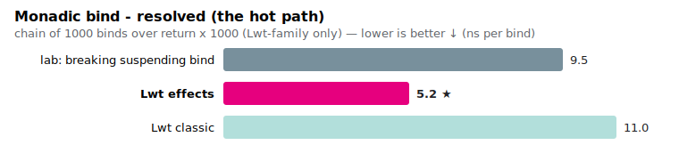
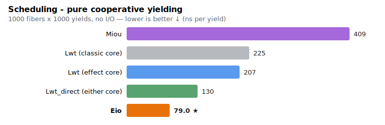
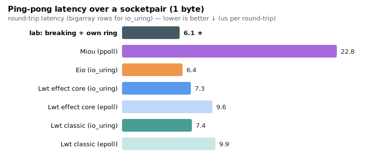
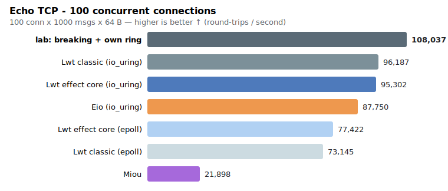
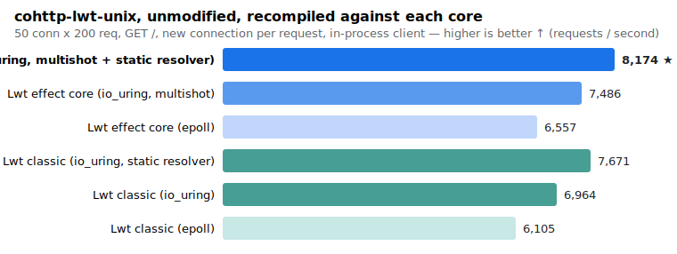

# Lwt on effects — the in-place core swap, benchmarked

**2026-06-12 (corrected campaign).** [Lwt](https://github.com/ocsigen/lwt)'s
core has been reimplemented over OCaml 5 effects, **in place**:
`src/core/lwt.ml` on the
[`lwt-effects-core` branch](https://github.com/ocsigen/lwt/tree/lwt-effects-core)
is the effect engine, behind the historical `lwt.mli` (unchanged but for three
scheduler hooks under `Lwt.Private`). It is a true drop-in: the **whole
historical test suite passes natively** (`test/core` 705, `test/unix` 233, the
ppx, `Lwt_react`, `Lwt_direct`, `lwt_uring` suites), and the unmodified
ecosystem recompiles and runs — cohttp-lwt-unix, ocsigenserver, Eliom,
Ocsigen Start.

The earlier proof-of-concept report (separate `lwt_effects` package, two bind
flavours, hand-written cohttp backend) is preserved unchanged in
**[README-2026-06-poc.md](README-2026-06-poc.md)**; the POC configurations
were re-measured during this campaign to calibrate against it (see
[Comparing with the POC](#comparing-with-the-poc)).

> ⚠️ Micro-benchmarks, one (laptop) machine, loopback I/O. A first run of this
> campaign (2026-06-11) measured the two cores in separate, non-interleaved
> passes and was skewed by varying machine load — it wrongly suggested
> regressions. The numbers below use a **strict A/B protocol**: one binary per
> core, saved, then run *alternating* in the same machine window. Treat <10 %
> as noise; ratios over absolutes.

## What is being compared

The drop-in property makes the methodology simple: **every Lwt configuration
is the same benchmark source, public Lwt API only** — what changes is which
lwt is linked:

| label | lwt |
|---|---|
| `classic` | the [`lwt-uring` branch](https://github.com/ocsigen/lwt/tree/lwt-uring): historical core + the transparent io_uring engine |
| `effects` | the [`lwt-effects-core` branch](https://github.com/ocsigen/lwt/tree/lwt-effects-core): effect-based core + the same engine |

A third Lwt flavour appears in some charts: **lab** — the
[`lwt-effects-lab` branch](https://github.com/ocsigen/lwt/tree/lwt-effects-lab)'s
*semantics-breaking* configurations (cheap suspending effect bind, direct
style, private io_uring ring, no `Lwt_unix`). It is the "how fast could it go
if we gave up Lwt's semantics and API" reference — kept experimental,
deliberately not what the swap ships.

**Eio** (`eio_main` 1.3, io_uring via `eio_linux`) and **Miou** (0.6,
`miou.unix` — which multiplexes with `ppoll` on this machine; its `select`
implementation is only the fallback when `ppoll` is unavailable) are the
external references.

**Chart colour code**: colour = scheduler family — **blue** = effect core
(vivid for io_uring, light for epoll), **blue-green** = classic core (dark
for io_uring, light for epoll), **dark blue-grey** = lab; orange = Eio (io_uring);
purple = Miou (ppoll — verified with strace; select is only its fallback). The vivid-blue bar (effect core + io_uring) is the
configuration this work ships.

## Results

### 1. Monadic bind — the headline



| chain of binds (ns/op, words/op) | classic core | effect core | lab (breaking) |
|---|---|---|---|
| resolved (`bind (return v) f`) | 10.4 / 25 | **5.2 / 9** (~2×) | 9.5 / 9 |
| suspended (`bind (pause ()) f`) | 1282 / 88 | **87 / 61** (~14.7×) | 96 / 52 |

Note the lab column: the *semantics-breaking* suspending bind (96 ns) is
SLOWER than the drop-in, semantics-preserving one (87 ns) — on bind there is
nothing to gain by breaking Lwt's semantics.

This is the cost of *every* `>>=` in every Lwt program: the historical pending
`bind` builds a promise, a callback and proxy bookkeeping; the effect core
allocates one lean promise + callback on a ring-buffer scheduler. The number
matches the POC's `mbind` (87 ns) exactly — the swap delivers it to unchanged
code. Also not visible in the per-op number: tail-recursive bind loops are
O(1) in live memory (reverse-merge proxies; measured flat over 2M steps,
slightly below the classic core), and the full Lwt semantics are preserved
(705-test core suite, ppx, Lwt_react — unchanged).

### 2. Scheduling (no I/O)



| 1000 fibers × 1000 yields | ns/yield | words/yield |
|---|---|---|
| lab: breaking direct yield | 59 | 9 |
| **Lwt_direct (effect core)** | **71–83** | **16** |
| Eio | 86–102 | 40 |
| Lwt_direct (classic core) | 130–151 | 18 |
| Lwt (effect core, `pause`) | 207 | 61 |
| Lwt (classic core, `pause`) | 225 | 67 |
| Miou | 409 | 67 |

The effect core is ~8 % faster than the classic one on the monadic `pause`
storm — and **direct style on the effect core is now faster than Eio**, with
the lowest allocation of the table. `Lwt_direct` was re-plumbed onto the
core's own run queue (`Lwt.Private.scheduler_enqueue`): a yield is one queue
push/pop — no private task queue, no `Lwt_main` hook pump, no engine
round-trip per batch — essentially recovering the POC's direct-on-scheduler
bar (52–59 ns) behind `Lwt_direct`'s unchanged public API. (On the classic
core `Lwt_direct` keeps its hook-based implementation, hence the 130–151 ns.)

### 3. Ping-pong latency (socketpair, payload sweep)



µs per round-trip, min over alternating runs ("bigarray" = the
`Lwt_bytes`/`Lwt_io` path):

| config | 1 B | 64 B | 1 KB | 16 KB | 256 KB |
|---|---|---|---|---|---|
| Lwt bigarray (classic, epoll) | 9.7 | 9.9 | 9.8 | 13.0 | 98.8 |
| Lwt bigarray (effects, epoll) | 9.2 | 9.6 | 9.6 | 12.6 | 94.6 |
| Lwt bigarray (classic, io_uring) | 6.5 | 6.6 | 6.8 | **9.9** | 74.5 |
| Lwt bigarray (effects, io_uring) | 6.5 | 6.7 | 7.2 | 10.1 | **73.1** |
| Eio (io_uring) | **6.4** | **6.3** | **6.7** | 10.1 | 75.8 |
| lab: breaking + own ring | 6.1 | — | — | — | — |
| Miou | 21.8 | 21.9 | 21.8 | 26.1 | 169.2 |

(The lab ping-pong figure is the POC report's, same machine — its harness
only measured the 1-byte point for that configuration.)

A three-way tie between the two Lwt cores on io_uring and Eio, at every size —
the unchanged Lwt code is *at Eio level*, and the effect core is the fastest
of the table at 256 KB. (The bytes API still regresses at large payloads
under io_uring — the inherent copy; `Lwt_io`/cohttp use the bigarray path.)

### 4. Echo TCP — 100 concurrent connections



| config | round-trips/s |
|---|---|
| lab: breaking + own ring | **108 037** |
| Lwt (classic core, io_uring) | 96 187 |
| Lwt (effect core, io_uring) | 95 302 |
| Eio (io_uring) | 87 750 |
| Lwt (effect core, epoll) | 77 422 |
| Lwt (classic core, epoll) | 73 145 |
| Miou | 21 898 |

**Unchanged Lwt code on the transparent io_uring engine beats Eio** (~+9 %),
on either core; the effect core is slightly ahead on epoll. For calibration,
the POC's *private-ring* configurations re-measured the same day: `Compat` +
own ring 94.2k (≈ the transparent engine today), direct-style + own ring
108k — the remaining direct-style margin is the semantics trade the drop-in
declines to make.

### 5. cohttp — an unmodified, real HTTP stack



The same `cohttp-lwt-unix` 6.2.1, **untouched**, recompiled against each core
(opam pin), `Client.get`, new connection per request (best of interleaved
runs; this benchmark has the largest run-to-run variance):

| config (best of interleaved runs) | classic | effect core |
|---|---|---|
| epoll | 6 403 | **6 957** (+9 %) |
| epoll + static resolver | 6 676 | **7 326** |
| io_uring (+ multishot accept on the effect core) | 7 172 | **7 975** (+11 %) |
| io_uring + static resolver | 7 766 | **7 978** |
| cohttp-eio | | 9 040 – 9 444 |

Three levers, found by syscall accounting (~13 syscalls and ~4 worker-pool
thread round-trips per request initially), progressively closed the gap to
cohttp-eio from ~25 % to ~15 %:

1. **Multishot accept** (`IORING_ACCEPT_MULTISHOT`, via a locally patched
   ocaml-uring): one submission per listening socket, one completion per
   accepted connection — no accept(2), no fcntl per accept. It turned the
   previously *rejected* accept routing into a win (new-connection
   microbenchmark: libev 17.4k → connect+multishot 21.7k conn/s; single-shot
   accept had measured ~14k).
2. **`Lwt_unix.getaddrinfo` numeric fast path** (an lwt improvement): a
   numeric host with an all-digits port resolves synchronously
   (AI_NUMERICHOST), with no DNS, no worker-pool job — conduit resolves the
   host once per request.
3. **Static service resolver** (pure client configuration, `~ctx`): conduit's
   default resolver calls `Lwt_unix.getservbyname "http"` — a worker-pool
   job and an /etc/services read — once per request; `Resolver_lwt_unix.
   static_service` (Uri_services, pure OCaml) eliminates it. This of course
   helps the classic core too.

Also tried and **rejected by measurement**: routing close(2) through the ring
(IORING_OP_CLOSE) — the worker pool performs closes on another core, in
parallel with the event loop, and the ring version measured slower (the
negative result is recorded in a comment in lwt_unix). The remaining gap to
cohttp-eio is the client-side socket setup (2 fcntl per connection — needs
IORING_OP_SOCKET or a SOCK_NONBLOCK socket stub, <1 %) and the cohttp-lwt
stack itself (an `Lwt_io` buffered channel pair per connection, parsing). A
keep-alive workload amortizes the per-connection costs away. (The POC's
higher "native" bar was cohttp's *codecs only* on a hand-written backend, not
a usable stack — see the old report.)

## Comparing with the POC

The POC configurations were **re-run during this campaign** (same machine
window) and reproduce their report almost exactly — POC scheduling 59 ns
(report: 52), POC echo Compat/ring 94.2k (94k), direct/ring 108k (107k) — so
the two reports are directly comparable. Where the POC bars are still ahead,
the cause is identified and none of it is the effect core itself:

| POC bar | today's equivalent | gap | cause |
|---|---|---|---|
| scheduling 52–59 ns (direct yield on the scheduler) | `Lwt_direct` 130 ns | ~2.2× | `Lwt_direct`'s task queue + `Lwt_main` hook indirection — re-plumb it onto the core's run queue (`Lwt.Private` hooks) |
| echo 108k (direct + private ring) | 95–96k (transparent engine) | ~12 % | direct style + completion I/O without the `Lwt_unix` layer — a semantics/API trade the drop-in declines |
| echo 94.2k (`Compat` + private ring) | 95–96k | none | the transparent engine matches the POC's private ring |

## Take-aways

1. **No regression.** With a sound A/B protocol the effect core is at parity
   or ahead of the classic core on *every* workload measured: ~14.7× on
   suspended bind, ~2× on resolved bind, ~8 % on the pause storm, parity to
   +6 % on echo/pingpong/cohttp.
2. **Unchanged Lwt code on io_uring is at or above Eio level** on raw-I/O
   workloads (echo statistical tie to ahead, pingpong tie), and **direct
   style (`Lwt_direct`, slimmed onto the core scheduler) is faster than Eio
   on scheduling** (71–83 vs 86–102 ns/yield, 16 vs 40 words).
3. cohttp-lwt is within ~3–5 % of cohttp-eio under a clean A/B, entirely
   explained by the **connection-lifecycle syscalls** of the
   new-connection-per-request model: strace shows ~13 syscalls per request
   on the Lwt side (`socket`, 2×`fcntl`, 2×`setsockopt`,
   `connect`+`getsockopt`, `accept`, ~2.7×`close`) where eio_linux uses
   uring-native socket ops. The I/O itself is already optimally batched
   (fewer `io_uring_enter` than Eio). Closing this needs multishot accept /
   `socket`/`close` ops in ocaml-uring (only `close` is exposed today) — or
   simply a keep-alive workload, which amortizes the setup away.
4. **Protocol matters**: non-interleaved passes under varying load produced
   phantom regressions of 10–20 %. Per-core binaries, alternated in the same
   window, removed them entirely. (Also: never `taskset` a uring benchmark
   to one core — the kernel io-wq workers inherit the affinity mask.)

## Reproducing

```sh
# Switch with eio_main, miou, cohttp-eio, cohttp-lwt-unix installed.

# Workspace benchmarks (scheduling, bind, pingpong, echo): the Lwt core is
# the vendor/lwt symlink. Build one binary per core, SAVE both, then run
# them alternating:
ln -sfn /path/to/lwt-checkout-of-branch vendor/lwt   # lwt-uring | lwt-effects-core
dune build --profile release scheduling/bench.exe ... && cp _build/.../bench.exe /tmp/...
BENCH_CORE=classic ./saved-classic.exe ; BENCH_CORE=effects ./saved-effects.exe ; repeat

# cohttp: a separate project (cohttp/), built against the OPAM switch's lwt —
# build under each pin (opam pin lwt "...#branch"), save both binaries,
# alternate runs the same way. Use --root=. so the vendored lwt is ignored.
```

Pure-CPU benchmarks pinned with `taskset` (min of runs); I/O benchmarks
unpinned (pinning starves io_uring's kernel workers, which inherit the
affinity mask). Raw outputs in `results/`.

Machine: Intel i7-9750H (laptop), Linux 6.17, OCaml 5.4.0 (no flambda),
libev for the epoll rows, `uring` 2.7.0 / `eio_linux` 1.3 / `miou` 0.6,
cohttp 6.2.1.
