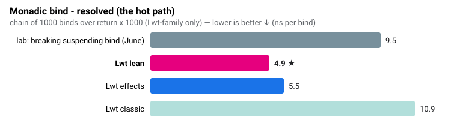
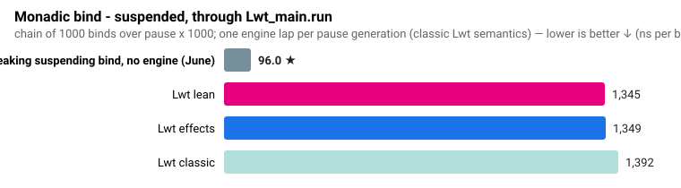
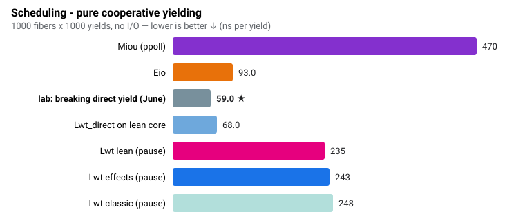
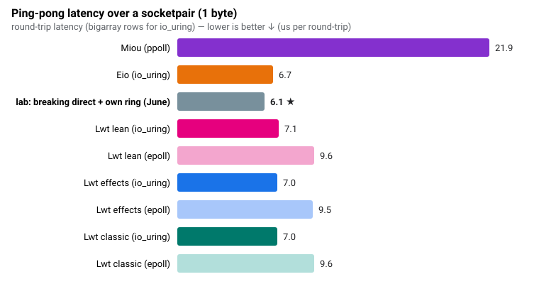
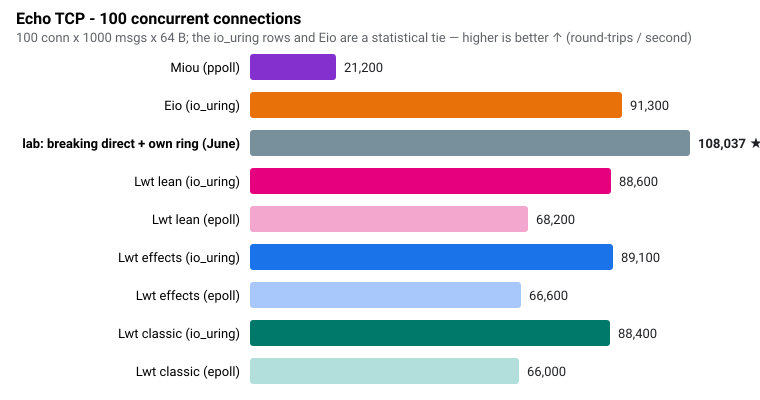
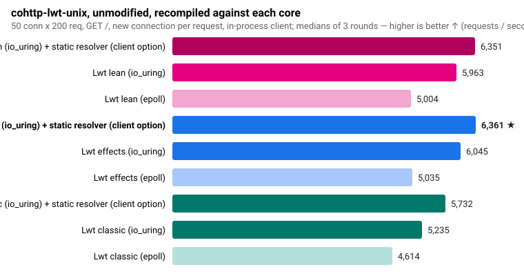
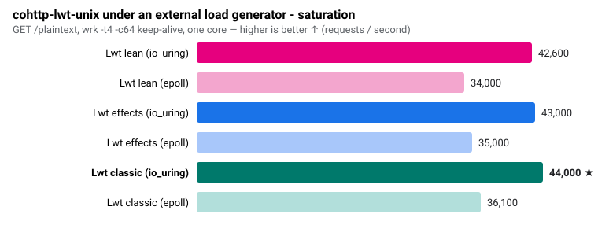
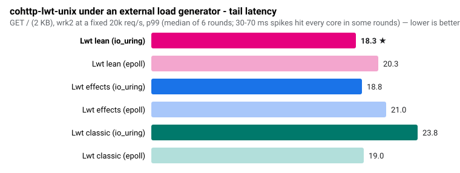
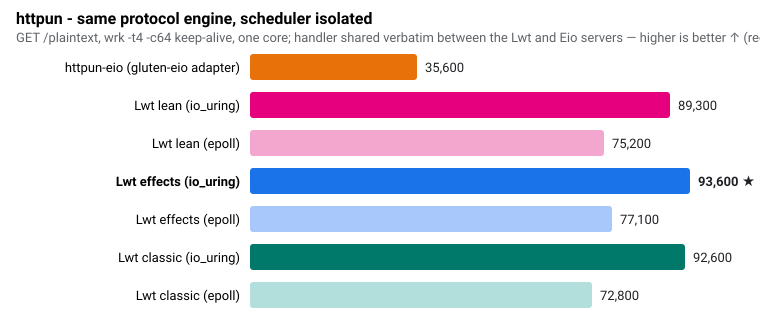

# Lwt on io_uring and effects — keeping the monad at direct-style speed

[Lwt](https://github.com/ocsigen/lwt) is the concurrency library a large part
of the OCaml ecosystem is built on — Ocsigen/Eliom, MirageOS, cohttp, and
twenty years of application code. It is **monadic**: a function that may
suspend returns an `'a Lwt.t`, so asynchrony is visible in its type.

OCaml 5 brought effect handlers, and with them a new generation of
**direct-style** I/O libraries — [Eio](https://github.com/ocaml-multicore/eio),
[Miou](https://github.com/robur-coop/miou) — with excellent performance. In
direct style, a function that may suspend looks like any other function.
That is pleasant to write, but it gives up something we care about:

- **Knowing, from the type, which calls can suspend.** In reactive
  programming (React/`Lwt_react`-style update propagation) and in
  **multi-tier programming** (Eliom's client/server tierless code), whether
  an expression can yield to the scheduler is semantically important —
  an invisible suspension point in the middle of an update cycle or of a
  shared client/server section is a bug you cannot see. Until OCaml has
  **typed effects**, the monad *is* the type discipline for suspension.
- **Implicit concurrency**: in Lwt, `both (a >>= f) (b >>= g)` runs both
  branches concurrently without any fork annotation. Large codebases rely
  on this semantics.
- **The ecosystem itself**: millions of lines compiled against `'a Lwt.t`.
  A migration to a new API is a cost most projects will never pay.

So the question this repository answers with benchmarks:

> **Can Lwt keep its API, its types and its semantics — and reach the
> performance of the effect-based, direct-style libraries?**

The answer is yes, in two independently useful layers:

1. **A transparent io_uring engine** for Lwt
   ([`lwt-uring`](https://github.com/ocsigen/lwt/tree/lwt-uring)): a new
   `Lwt_engine` backend; existing programs switch to io_uring with one line
   (or a default), no other change.
2. **A reimplementation of Lwt's core on OCaml 5 effects**
   ([`lwt-effects-core`](https://github.com/ocsigen/lwt/tree/lwt-effects-core)):
   `src/core/lwt.ml` rewritten over effect handlers, behind the **unchanged**
   `lwt.mli`. A true drop-in: the whole historical test suite passes
   natively (`test/core` 705 tests, `test/unix` 233, the ppx, `Lwt_react`,
   `Lwt_direct`, `lwt_uring` suites), and the unmodified ecosystem
   recompiles and runs — cohttp-lwt-unix, ocsigenserver, Eliom,
   Ocsigen Start.

**Headline results** (details and methodology below):

- **io_uring is the big I/O win**: on real HTTP serving, switching the
  engine under unchanged code raises saturation throughput by **+22–27 %**
  (cohttp) to **+27–44 %** (httpun) depending on the session, and cuts
  small-message round-trip latency from 9.6 to 7.0 µs.
- **The rewritten core makes the monad itself cheaper**: an already-resolved
  `bind` — the hot path of monadic code — costs **~5 ns instead of ~11
  (~2×), with a third of the allocation**; cooperative scheduling is at
  parity to a few percent faster; an unmodified cohttp server gains
  **+7–15 %** depending on the session; and GC pauses stay **below 1.5 ms
  max under full load on every core** (the June session measured the
  rewritten core ahead, 1.0 vs 1.7 ms; the July one, parity).
- **Against Eio, scheduler for scheduler, unchanged Lwt code on io_uring is
  at Eio level**: a statistical tie on the echo and ping-pong I/O
  benchmarks, and the opt-in direct style (`Lwt_direct`, on the rewritten
  core's own run queue) is **faster than Eio at pure scheduling**
  (65–76 vs 90–97 ns/yield, 14 vs 40 words). Where an Eio-based stack beats
  an Lwt-based stack (cohttp-eio vs cohttp-lwt, ~5–9 %), holding the HTTP
  engine constant (httpun) shows the difference is the *stack*, not the
  scheduler.
- **Interestingly, the "cost of effects" is zero for monadic code**: a
  `perf` profile of the effect core serving HTTP shows the OCaml 5 effect
  primitives (`perform`, stack switching, `continue`) at 0.00 % of samples.
  Monadic `bind` never suspends a fiber; effects structure the scheduler
  and enable the direct style, and you pay for them only when you use them.
- **A control experiment settles the attribution** (section 9): removing
  the effect layer from the rewritten core entirely, a ~50-line surgery
  (branch `lwt-lean-core`), changes no benchmark result, monadic or
  direct-style, and the whole test suite still passes. The speedups come
  from the rewrite itself (lean promises, no proxy machinery, the run
  queue, removable waiters); the fast direct style only needs the core's
  run-queue hook. One practical consequence: the rewritten core, in its
  lean form, no longer requires OCaml 5 by itself; only the opt-in
  direct-style package (`Lwt_direct`) does.

The earlier proof-of-concept report (separate `lwt_effects` package, two
bind flavours) is preserved in
[README-2026-06-poc.md](README-2026-06-poc.md).

> ⚠️ All numbers: micro-benchmarks and loopback I/O on one laptop
> (Intel i7-9750H, Linux 6.17, OCaml 5.4.0 without flambda). Treat
> differences under 10 % as noise; prefer ratios to absolutes. Two
> measurement sessions coexist: the June campaign and a 2026-07 trio
> session that added the `lean` core; absolute figures drift between
> sessions, so every cross-core comparison is made within one session
> (each table says which). The
> [methodology section](#how-we-measured-methodology) describes the
> protocol that makes these numbers reproducible.

## What we built

### Layer 1 — the transparent io_uring engine

Lwt's event loop is pluggable (`Lwt_engine`): historically select, poll or
libev (epoll). `lwt_uring` adds an io_uring backend behind the same
interface. Readiness-based I/O keeps working unchanged; on top of it, the
engine routes a growing set of operations through the ring as *completions*
(reads, writes, connect, accept), batching submissions and avoiding
syscall-per-operation. Because it is just another engine, **every existing
Lwt program benefits without recompiling anything but the engine choice**.

Two refinements that matter under connection churn:

- **Multishot accept** (`IORING_ACCEPT_MULTISHOT`): one submission per
  listening socket, one completion per accepted connection — no accept(2)
  and no fcntl per connection. (Requires a patched ocaml-uring until the
  feature is upstream.) In a new-connection micro-benchmark this took
  accept throughput from 17.4k conn/s (libev) to 21.7k.
- **`Lwt_unix.getaddrinfo` numeric fast path**: a numeric host and port
  resolve synchronously (`AI_NUMERICHOST`) — no DNS, no worker-pool job.

### Layer 2 — the effect-based core

`src/core/lwt.ml` reimplemented over OCaml 5 effects, behind the unchanged
`lwt.mli`. The key design decisions:

- **`bind` stays non-suspending.** A pending `bind` allocates one lean
  promise and one callback — like Lwt, *minus* Lwt's proxy machinery — and
  preserves implicit concurrency. (An effect-based *suspending* bind was
  prototyped and measured: it is not faster, and it silently changes Lwt's
  semantics. It is not the default and never will be.)
- **Effects structure the scheduler.** The run queue is an array ring
  buffer; resuming a suspended computation is a queue push/pop, with the
  continuation stored unboxed (no closure per resumption). Monadic code
  runs in a single fiber and never performs an effect; fibers and
  suspensions are paid for only by code that opts into direct style.
- **Direct style as an opt-in, not a replacement**: `Lwt_direct` (a
  `spawn`/`await` interface over the same scheduler) gives Eio-style code
  *inside* an Lwt program, on the core's own run queue — and it benchmarks
  faster than Eio.
- **Promise internals tuned for the long haul**: proxy links are
  reverse-merged so tail-recursive bind loops are O(1) in live memory
  (measured flat over 2M iterations); link chases are path-compressed;
  promises attached to *several* sources (`choose`/`pick` and the
  cancellation mirrors) install **removable** waiters that detach from the
  losers as soon as one source resolves — on a long-lived promise (a
  server's shutdown promise, one `pick` per connection, as conduit does)
  this is what keeps memory flat over hours. We validate it under load:
  the live set, sampled after a full major GC during a sustained run, stays
  constant.
- **Classic loop semantics are preserved to the letter**, including the
  interleaving of `Lwt.pause` with the I/O engine: each pause generation
  yields to one engine iteration, exactly like the historical `Lwt_main`
  lap, so a pause loop can never starve I/O. (This is visible in one
  micro-benchmark below: a serial chain of pauses is dominated by that
  engine lap on *both* cores — the cost is the semantics, not the
  implementation.)

A third configuration appears in some charts: **lab**
([`lwt-effects-lab`](https://github.com/ocsigen/lwt/tree/lwt-effects-lab)),
the *semantics-breaking* experiments (suspending bind, direct style on a
private ring, no `Lwt_unix`). It is the "how fast could it go if we gave up
Lwt's semantics and API" ceiling — kept experimental, deliberately not what
ships. Its main lesson: the ceiling is close (e.g. echo 108k vs 95k rt/s),
and on `bind` the semantics-breaking version is *not* faster.

## What is being compared

The drop-in property makes the methodology simple: **every Lwt
configuration is the same benchmark source, public Lwt API only** — what
changes is which lwt is linked:

| label | lwt |
|---|---|
| `classic` | the [`lwt-uring` branch](https://github.com/ocsigen/lwt/tree/lwt-uring): historical core + the transparent io_uring engine |
| `effects` | the [`lwt-effects-core` branch](https://github.com/ocsigen/lwt/tree/lwt-effects-core): effect-based core + the same engine |
| `lean` | the [`lwt-lean-core` branch](https://github.com/ocsigen/lwt/tree/lwt-lean-core): the same rewritten core with the effect layer removed (the control experiment of section 9, added 2026-07) + the same engine |

**Eio** (`eio_main` 1.3, io_uring via `eio_linux`) and **Miou** (0.6,
`miou.unix`, which multiplexes with `ppoll` on this machine) are the
external references.

A further experiment sits on a *different axis*: **Lwt on Eio** (branch
[`lwt-on-eio-poc`](https://github.com/ocsigen/lwt/tree/lwt-on-eio-poc)). It is
not a different *core* but the classic core run on Eio's *runtime* (loop and
io_uring ring) instead of Lwt's own engine. It answers a different question
(reuse Eio vs the maison ring) and is a server-only, opt-in backend, so it is
measured on its own in section 8.

**Chart colour code**: the **bright magenta bar is the configuration this
work ships** — the lean core on the io_uring engine, labeled
**“Lwt lean (io_uring)”** in every chart (multishot accept included: it
is part of the engine, not an option); light pink = the lean core on
epoll/libev, dark magenta = the shipped configuration plus an *optional
client-side configuration* (e.g. the static resolver). The other colours
are families: blue = the effect core (dark: io_uring, light: epoll),
blue-green = classic core (dark: io_uring, light: epoll), dark
blue-grey = lab — one colour, but note that each lab row is a *different*
semantics-breaking experiment (suspending bind, direct yield on the bare
scheduler, direct style on a private ring), named in its label; orange =
Eio (io_uring), purple = Miou (ppoll). The charts draw the 2026-07 trio
session; rows kept from June say "(June)" in their label.

## The benchmarks, why they are relevant, and the results

The suite covers the stack bottom-up: the cost of the monad itself (bind),
of the scheduler (yields), of single-connection I/O (ping-pong), of
concurrent I/O (echo), then two real HTTP stacks under a real load
generator. Each level catches what the previous one cannot.

### 1. Monadic bind — the cost of every `>>=`




**What it measures**: the cost of the monad's central operation, in its two
regimes — `bind` on an already-resolved promise (the fast path), and `bind`
on a pending one (one promise + one callback per step; on the classic core,
plus its proxy machinery).

**How**: two recursive chains of 1000 binds, run under `Lwt_main.run` —
`bind (return v) f` (repeated 5000×) and `bind (pause ()) f` (repeated
1000×) — public Lwt API only, the core chosen by which lwt is linked. After
a warm-up pass and a `Gc.full_major`, we report wall time per operation and
minor-heap words per operation (`Gc.minor_words` delta). CPU-pinned
(`taskset`), minimum over interleaved runs of the two per-core binaries.
(Eio and Miou have no bind — this table is Lwt-family only.)

| chain of binds (ns/op, words/op) | classic core | effect core | lean core | lab (breaking) |
|---|---|---|---|---|
| resolved (`bind (return v) f`) | 10.9–13.2 / 25 | 5.5–6.0 / 9 (~2×) | **4.9–6.4 / 9** (~2×) | 9.5 / 9 |
| suspended (`bind (pause ()) f`, through `Lwt_main.run`) | 1392–1497 / 88 | 1349–1398 / 71 | **1345–1384 / 71** | 96 / 52 |

(Lwt trio re-measured 2026-07 in one interleaved session; the lab column is
the June measurement. The June effect-core figures, 5.1–5.2 and 1262–1284,
are within the session-to-session drift.)

The resolved row is the common case of hot monadic code — every
already-resolved `>>=` in every Lwt program. The historical bind's
promise + callback + proxy bookkeeping becomes one lean promise: **~2×
faster, a third of the allocation** — identically on the effect core and on
the lean (no-effects) core, which share the promise layout.

*The lab rows here*: “lab: breaking suspending bind” is the lab branch's
effect-based bind that **suspends the fiber** instead of allocating a
promise and a callback — silently giving up Lwt's implicit concurrency.
On the resolved chart it shows that breaking the semantics buys *nothing*
on bind; on the suspended chart, the lab scheduler additionally drives
**no I/O engine at all** — that, not the bind, is why it reads 96 ns.

The suspended row measures a *serial* chain of `pause`s through the full
main loop. Lwt's semantics make each pause generation interleave with one
I/O-engine iteration (so pause loops cannot starve I/O); that engine lap
(~1.3 µs of libev) dominates the figure on **all three** cores — the
rewritten cores' leaner machinery shows as a few percent and 17 fewer
words. The lab column shows what a scheduler with no engine to honour
measures; the *pause storm* below shows the batched picture, where one lap
is amortized over a thousand resumptions.

Also not visible per-op: tail-recursive bind loops are O(1) in live memory
on the rewritten cores (reverse-merged proxies, measured flat over 2M
steps).

### 2. Scheduling — pure cooperative yielding



**What it measures**: the pure cost of suspending and resuming a
computation, with no I/O at all — the scheduler itself. This is the regime
of reactive code (`Lwt_react` update cycles), pause storms and multi-tier
round-trips: workloads that are scheduler-bound, not I/O-bound.

**How**: 1000 concurrent fibers each yield 1000 times (one million
suspension/resumption cycles). Four implementations of the same workload:
Lwt monadic (1000 concurrent `pause`-chains joined under `Lwt_main.run`),
`Lwt_direct` (`spawn`/`yield`, direct style over the same core), Eio
(`Fiber.fork`/`Fiber.yield` under `Eio_main.run`) and Miou
(`Miou.async`/`Miou.yield`). Reported: ns and minor-heap words per yield;
CPU-pinned, warm-up + `Gc.full_major` before measuring.

| 1000 fibers × 1000 yields | ns/yield | words/yield |
|---|---|---|
| lab: breaking direct yield (June) | 59 | 9 |
| **Lwt_direct (lean core)** | **65–70** | **14** |
| Lwt_direct (effect core) | 72–76 | 14 |
| Eio | 90–97 | 40 |
| Lwt_direct (classic core) | 124–130 | 12 |
| Lwt (lean core, `pause`) | 234–236 | 61 |
| Lwt (effect core, `pause`) | 241–245 | 61 |
| Lwt (classic core, `pause`) | 243–252 | 67 |
| Miou | 449–490 | 67 |

(Trio re-measured 2026-07, one interleaved session, Eio and Miou in the
same windows; the per-yield allocation of `Lwt_direct` changed slightly
since June on all branches, an effect-handler syntax change.)

The monadic `pause` storm is at parity to a few percent faster on the
rewritten cores (all cores pay one engine lap per pause generation,
amortized here over the 1000-fiber batch). The headline is direct style:
**`Lwt_direct` on the rewritten core's run queue is faster than Eio**, with
the lowest allocation of the table next to the classic core's — a yield is
one ring-buffer push/pop. Note that the lean core, which contains no effect
machinery, serves `Lwt_direct` at full speed: the direct style needs the
core's run-queue hook, not an effect-based core.

*The lab row here*: a direct-style yield on the lab branch's **bare
scheduler** — no `Lwt_main`, no engine, no promise: the absolute floor for
one suspension/resumption cycle.

### 3. Ping-pong — single-connection I/O latency



**What it measures**: the latency of one I/O round-trip through the engine
— the cost a single request/response pays, swept over payload sizes from
1 B to 256 KB.

**How**: a client fiber and a server fiber exchange a message of the given
size back and forth over a Unix socketpair (round-trip count scaled so each
size moves a bounded total volume). Two Lwt I/O paths are measured: *bytes*
(`Lwt_unix.read/write` — under io_uring this path pays a bytes↔Cstruct copy
per call, the worst case) and *bigarray* (`Lwt_bytes`, the path `Lwt_io`
and therefore cohttp actually use — copy-free under io_uring). Because
`Lwt_uring.set ()` is process-global, each binary runs two passes: default
engine plus Eio/Miou first, then io_uring. Unpinned (io_uring's kernel
workers must roam). Table: µs per round-trip, min over alternating runs
(bigarray rows for io_uring):

| config | 1 B | 64 B | 1 KB | 16 KB | 256 KB |
|---|---|---|---|---|---|
| Lwt bigarray (classic, epoll) | 9.6 | 9.7 | 10.4 | 13.1 | 95.8 |
| Lwt bigarray (effects, epoll) | 9.5 | 9.4 | 9.7 | 13.1 | 95.7 |
| Lwt bigarray (lean, epoll) | 9.6 | 9.5 | 10.0 | 12.7 | 94.8 |
| Lwt bigarray (classic, io_uring) | 7.0 | 7.0 | 7.0 | 10.0 | 77.4 |
| Lwt bigarray (effects, io_uring) | 7.0 | 7.1 | 7.3 | 10.4 | 76.6 |
| Lwt bigarray (lean, io_uring) | 7.1 | 7.0 | 7.6 | 10.3 | **76.2** |
| Eio (io_uring) | **6.7** | **6.6** | 7.1 | **10.1** | 76.0 |
| lab: breaking direct + own ring (June) | 6.1 | — | — | — | — |
| Miou | 21.9 | 21.9 | 22.0 | 27.5 | 177.8 |

(Trio re-measured 2026-07, min over 2 interleaved rounds; Eio and Miou from
the same session.)

io_uring is worth ~2.5 µs per round-trip to Lwt at every size. The three
Lwt cores are indistinguishable at every size on both engines: this
benchmark is engine-dominated, as expected. Against Eio it is effectively a
tie: Eio keeps a small edge (≲0.5 µs) at the smallest payloads, the gap
closes by 1 KB, and the rewritten cores are fastest at 256 KB — unchanged
Lwt code *at Eio level*.

*The lab row here (and in the echo table below)*: the lab branch's direct
style driving its **own private io_uring ring**, bypassing `Lwt_unix` and
`Lwt_engine` entirely — completion I/O with none of Lwt's compatibility
layers.

### 4. Echo — 100 concurrent connections



**What it measures**: throughput under concurrent I/O pressure — the
scheduler and the engine juggling many simultaneous connections, with no
HTTP stack in the way. Where ping-pong measures one connection's latency,
this measures how well a hundred of them share one core.

**How**: a loopback TCP server accepts 100 connections, each served by its
own handler fiber; 100 client fibers connect and ping-pong 1000 messages of
64 bytes each — everything concurrent in one process (200 fibers + the
accept loop). Reported: round-trips per second (100 000 round-trips total).
Same two-pass engine scheme as ping-pong, unpinned. (Ranges over
interleaved rounds; Eio is measured inside each binary run, so it has
samples in the same windows.)

| config | round-trips/s |
|---|---|
| lab: breaking direct + own ring (June) | **108 037** |
| Eio (io_uring) | 89.1k – 93.5k |
| Lwt (lean core, io_uring) | 85.6k – 91.6k |
| Lwt (effect core, io_uring) | 85.0k – 93.1k |
| Lwt (classic core, io_uring) | 87.3k – 89.4k |
| Lwt (lean core, epoll) | 67.2k – 69.2k |
| Lwt (effect core, epoll) | 64.5k – 68.7k |
| Lwt (classic core, epoll) | 63.3k – 68.7k |
| Miou (ppoll) | 21.1k – 21.3k |

(Trio re-measured 2026-07, 3 interleaved rounds, Eio and Miou in the same
windows; one Miou dip to 17.3k in a later round left out of the range.)

**The four io_uring rows are a statistical tie** — unchanged Lwt code on
the transparent engine is at Eio level, on all three cores. epoll →
io_uring is worth ~+30 % here. For calibration, the lab's private-ring configurations re-measured in
the same windows: `Compat` + own ring 94.2k (≈ the transparent engine),
direct style + own ring 108k — the remaining direct-style margin is the
semantics trade the drop-in declines to make.

### 5. cohttp — an unmodified, real HTTP stack



**What it measures**: a real, unmodified HTTP stack end-to-end on each
core, with **connection churn** — every request pays the full connection
lifecycle (socket, connect, accept, close), which is where the
per-connection optimisations either pay or don't.

**How**: the same `cohttp-lwt-unix` 6.2.1, **untouched**, simply
recompiled against each core (opam pin). An in-process server answers a
fixed body to `GET /`; 50 concurrent client fibers each perform 200
`Client.get`, opening a **new connection per request** — client and server
share the process and the core (closed loop), so absolute numbers are low
by construction. A second pass installs the io_uring engine
(`Lwt_uring.set ()`, process-global). Median of 3 interleaved rounds
(2026-07 trio session) — this benchmark has the largest run-to-run variance
of the suite.

Reading the rows: the magenta **“Lwt lean (io_uring)”** bar is the
shipped configuration, out of the box — multishot accept is built into its
engine, not something to enable. The **“+ static resolver”** rows are *not
a different lwt*: a one-line client configuration (`~ctx`) that avoids a
per-request `getservbyname`; it benefits both cores equally and is shown
as the optional extra it is.

The chart shows cohttp-lwt only: for context, **cohttp-eio** measured
7 316–7 795 req/s in the same windows — but it is a recent, independent
Eio-native implementation that shares little beyond types with cohttp-lwt,
so the comparison says more about the two stacks than about the schedulers
(§7 holds the engine constant).

| config | classic | effect core | lean core |
|---|---|---|---|
| epoll | 4 614 | **5 035** (+9 %) | 5 004 (+8 %) |
| epoll + static resolver | 5 035 | **5 547** | 5 528 |
| io_uring (+ multishot accept on the rewritten cores) | 5 235 | **6 045** (+15 %) | 5 963 (+14 %) |
| io_uring + static resolver | 5 732 | **6 361** (+11 %) | 6 351 (+11 %) |
| cohttp-eio | | 7 316 – 7 795 | |

This is where the per-connection optimisations show (see
[the optimisations](#the-optimisations-and-what-each-bought)): syscall
accounting found ~13 syscalls and ~4 worker-pool round-trips per request in
the connection lifecycle, and three of them could be removed. The remaining
gap to cohttp-eio (~5–9 % in the June session, 13–18 % in the July one; the
ratio moves with machine state) is the stack itself (an `Lwt_io` buffered
channel pair per connection, conduit, older parsing) plus the client-side
socket setup — and it is the stack, not the scheduler, as §7 demonstrates
directly.

### 6. Realistic HTTP — external load generator, latency percentiles




**What it measures**: serving-pipeline behaviour that in-process
micro-benchmarks *cannot* see — arrival batching, fairness across
connections, GC pauses under steady load, memory behaviour over minutes of
sustained traffic.

**How**: standalone server binaries (one per core and engine, the server
sources taken verbatim from the upstream benchmark repositories), loaded
over real TCP by **wrk2 running as a separate process**. Two existing
methodologies are reproduced faithfully:

- **[ocaml-multicore/retro-httpaf-bench](https://github.com/ocaml-multicore/retro-httpaf-bench)**:
  `GET /` with a ~2 KB body, wrk2 at *fixed rates* with latency
  percentiles, scaled to one laptop core (`-t 4 -c 100`, rates 5k/10k/20k).
- **[robur-coop/httpcats bench protocol](https://github.com/robur-coop/httpcats/tree/main/bench)**:
  `GET /plaintext`, wrk at saturation, repeated runs; their Miou server
  run with `DOMAINS=1` for a single-core comparison.

The servers also expose a `/gc` route (`Gc.full_major`, then report
`live_words`) so memory health can be sampled *during* a run — a flat live
set over minutes of load is part of the pass criterion.

The two charts answer two different questions about the same server — and
neither is the question §5 answered, which is why the scales differ so
much:

- **§5 (above)** runs client *and* server **in the same process**, closed
  loop, with a **new connection per request**: every request pays the full
  connection lifecycle and shares the core with the client. Low absolute
  numbers (~6–8k req/s), but the right harness for A/B-ing a core under
  connection churn.
- **Saturation (first chart)** uses the **external** load generator on
  **keep-alive** connections with the throttle open: the server has the
  whole core to itself and pays no per-request connection setup. It
  measures *peak serving capacity* — hence figures ~6× those of §5.
- **Tail latency (second chart)** is the same external harness but at a
  **fixed 20k req/s** (open loop), measuring the **99th-percentile response
  time**: not "how much can it serve" but "how long does the worst 1 % wait
  when the load is below saturation". Scheduling fairness, GC pauses and
  arrival batching show up here — and the unit is milliseconds, not
  requests per second.

The charts show cohttp-lwt only. For context, the reference stacks measured
in the same windows: **cohttp-eio** 68–82k req/s at saturation and p99
4.0 / 4.6 / 8.5 ms at 5k/10k/20k; **httpcats** (Miou, 1 domain) 32.6k req/s
and p99 8.1 / 7.8 / 5.2 ms. Both are *very different implementations* (a
recent Eio-native stack; an h1-based stack on Miou): they bound the design
space but do not compare schedulers — §7 does that properly, holding the
HTTP engine constant.

| config | saturation (req/s, /plaintext) | p99 @5k | p99 @10k | p99 @20k |
|---|---|---|---|---|
| cohttp-eio | **87.5–88.8k** | **2.5 ms** | 3.8 ms | **5.5–6.2 ms** |
| cohttp-lwt, classic (io_uring) | 43.8–44.1k | 3.3 ms | 3.9 ms | 18.7 ms |
| cohttp-lwt, effect core (io_uring) | 42.8–43.2k (−2.2 %) | 3.0 ms | **3.0 ms** | 18.6 ms |
| cohttp-lwt, lean core (io_uring) | 42.0–43.1k (−3.2 %) | 3.1 ms | 5.5 ms | 18.8 ms |
| cohttp-lwt, classic (epoll) | 35.6–36.5k | 3.4 ms | 10.3 ms | 19.8 ms |
| cohttp-lwt, effect core (epoll) | 34.9–35.2k (−2.9 %) | 3.5 ms | 8.5 ms | 21.0 ms |
| cohttp-lwt, lean core (epoll) | 32.9–35.0k (−5.8 %) | 3.1 ms | 10.2 ms | 20.3 ms |
| httpcats (Miou, 1 domain) | 31.6–32.7k | 5.3 ms | 8.9 ms | 2.9–7.4 ms |

(One 2026-07 evening window, all eight servers interleaved: two saturation
rounds, one round at 5k/10k. The 20k column is the **median of 8 rounds**
spread across the evening's windows — at that rate 30–70 ms spikes hit
*every* core in some rounds, so single rounds mislead; the medians sit in
one band and the per-round swing of a single core exceeds the spread
between cores. The June campaign measured the same shape at higher
absolutes: classic io_uring 45.0k, +27 % over epoll, cores at parity.)

Findings:

1. The transparent io_uring engine is worth **+22–27 %** to Lwt at
   saturation depending on the session (35.6–36.5k → 43.8–44.1k here) —
   its largest win on this stack, on unchanged code.
2. The three Lwt cores are at **latency parity at every rate** (20k
   medians 18.6–18.8 ms on io_uring; the dedicated June interleaved A/B
   gave 16.99 ms effect vs 17.05 ms classic) and within a few percent at
   saturation. The rewritten cores' small saturation deficit (−2 to −3 %
   on io_uring here, −1 to −4 % across sessions) is shared by the effect
   and the lean cores alike: it belongs to the rewrite's memory-access
   profile, not to effects (section 9).
3. Under `olly` at full saturation, GC pauses stay **below 1.5 ms max on
   every core** (this session: classic 1.34 ms, lean 1.43 ms; the June
   session had measured the rewritten core ahead, 1.0 vs 1.7 ms — call it
   parity with excellent pauses all around).
4. httpcats/Miou has the most *stable* latency of the table at modest
   throughput — consistent with its bench report's fairness claims;
   cohttp-eio dominates this table on both axes. **Read that dominance for
   what it is: a comparison of HTTP *stacks***, settled next.
5. Memory health: the `/gc` live set stays **flat** under sustained load on
   all three cores (removable waiters at work on the rewritten ones).

### 7. httpun — the same protocol engine on every scheduler



**What it measures**: the schedulers compared **at constant HTTP stack** —
the comparison cohttp cannot give. **httpun** (the maintained httpaf fork)
has a single, scheduler-agnostic protocol engine (angstrom parser, faraday
serializer, a CPS state machine); its per-scheduler adapters are thin
Gluten I/O pumps with the *same* request-handler signature.

**How**: two standalone servers sharing their request handler **verbatim**
([`httpun_handler.ml`](http/httpun_handler.ml)) — the Lwt one
(`Httpun_lwt_unix` over `Lwt_io.establish_server_with_client_socket`,
built once per core via the opam pin, `-u` selects io_uring) and the Eio
one (`Httpun_eio` over `Eio.Net.accept_fork`). Same external wrk2 harness
as §6 (saturation + fixed-rate p99). wrk keeps connections alive, so this
measures *per-request* cost (connection setup amortized) — complementary
to the connection-per-request cohttp tables.

| config | saturation (req/s) | p99 @20k req/s |
|---|---|---|
| httpun-lwt, classic (io_uring) | 91.8k – **101.3k** | 6.6 – 7.7 ms |
| httpun-lwt, effect core (io_uring) | 92.2k – 93.0k | 7.8 – 8.9 ms |
| httpun-lwt, lean core (io_uring) | 85.6k – 90.6k | 6.9 – 7.9 ms |
| httpun-lwt, classic (epoll) | 72.1k – 80.1k | 3.7 – 8.4 ms |
| httpun-lwt, effect core (epoll) | 75.4k – 77.1k | 4.4 – 8.8 ms |
| httpun-lwt, lean core (epoll) | 68.5k – 75.9k | 8.9 – 9.5 ms |
| httpun-eio (gluten-eio) | 35.6k | 14.2 – 21.4 ms |

(2026-07, two windows of the same evening: the io_uring rows and
httpun-eio interleaved in one window, the epoll rows in an earlier one
whose io_uring anchors matched. The June session's figures, e.g. classic
98.0–100.2k at saturation and httpun-eio 34.5–34.8k, are in the same
bands.)

What it shows:

- **Swap the stack and the picture inverts: unchanged Lwt code at ~100k
  req/s is ~2.7× httpun-eio and ~2.2× the cohttp-lwt stack** at
  saturation, same machine, same protocol. The cohttp table's "Eio
  dominance" is the *stack*, definitively.
- A fairness caveat in the other direction: httpun-eio's 35.6k says less
  about the Eio *scheduler* than about the off-the-shelf **gluten-eio
  adapter** (cohttp-eio reaches ~88k on this very protocol). Adapter
  quality is a real variable even at constant engine — and the mature,
  hand-tuned adapter is the Lwt one.
- io_uring again: **+27–44 %** over epoll on this lean stack depending on
  the session (the leaner the stack, the more the engine shows).
- The three Lwt cores are a **statistical tie on both engines**: each core
  wins some rounds, the bands overlap, and the p99 tails sit in one
  single-digit band. (The June session's apparent 0–16 % effect-core
  saturation deficit does not reproduce; it was thermal round-to-round
  variance, as suspected then.)

### 8. Lwt on Eio: reusing Eio's runtime instead of the maison ring

A separate question (branch
[`lwt-on-eio-poc`](https://github.com/ocsigen/lwt/tree/lwt-on-eio-poc)):
instead of Lwt owning its io_uring engine, can Lwt run *on top of Eio's*
runtime, so a program already built on Eio shares one event loop and one ring
with its Lwt code, and the two ecosystems interoperate? This pushes the
[`lwt_eio`](https://github.com/ocaml-multicore/lwt_eio) idea one step further.
Two levels, both keeping Lwt's public API and semantics unchanged:

- **Level A** = today's `lwt_eio`: an `Lwt_engine` whose readiness and timers
  are driven by Eio. Lwt and Eio share the loop, but Lwt still issues its own
  `Unix.read`/`write` (readiness model), so there is no io_uring benefit for
  Lwt's I/O.
- **Level B** (the new part): fill Lwt's `Lwt_unix.set_completion_io` seam (the
  same one the maison io_uring backend uses) with Eio's completion ops
  (`Eio_linux.Low_level`), so Lwt's own `read`/`write` ride Eio's shared ring.
  Correctness is proven end to end (strace: the socket transfers are
  `io_uring_enter`, zero readiness `read`/`write`); interop both directions and
  an Eio `Domain_manager` offload driven from Lwt also pass.

**What it costs.** Ping-pong payload sweep, all rows measured in one process on
the same machine (bigarray = the `Lwt_io`/cohttp path; µs per round-trip, lower
is better; single run, no flambda, indicative):

| config | 1 B | 64 B | 1 KB | 16 KB | 256 KB |
|---|---|---|---|---|---|
| Lwt + libev | 10.9 | 10.8 | 11.2 | 14.3 | 103.5 |
| Lwt on Eio, Level A (readiness) | 10.4 | 11.1 | 10.6 | 14.7 | 110.8 |
| Lwt on Eio, Level B (completion, Eio ring) | 12.2 | 12.3 | 13.0 | 16.4 | **91.5** |
| Eio native (io_uring) | **6.6** | **6.7** | **7.2** | **10.5** | 79.2 |

For reference, Lwt on the **maison** io_uring ring (section 3) is ~7 µs at
these small sizes; the internal `test/uring` bench on this machine reads libev
10.1, maison io_uring via `Lwt_unix` 8.4, explicit 7.9 µs at 64 B.

**Reading it, honestly:**

- **Level A tracks libev** at every size: sharing Eio's loop buys interop, not
  I/O speed (as expected, it is still the readiness model).
- **Level B is slower than both libev and the maison ring at small payloads**
  (12 vs 10.1 vs 8.4 µs at 64 B). The reason is structural: Eio's public
  completion API (`Low_level.readv`, ...) is *direct-style* (it suspends the
  caller), so bridging it into Lwt's *callback-style* `completion_io` requires
  forking one Eio fiber per I/O. The maison backend, using the `uring` library's
  callback API directly, has no such per-op fork. (Caching the Eio `Fd` wrapper
  per descriptor, versus wrapping it per op which was even worse, recovered a
  few µs; the fiber fork is the residual, inherent cost.)
- Level B only wins where the transfer dominates and is copy-free: bigarray at
  256 KB, 91.5 µs, below libev (103.5) and approaching Eio native (79.2). The
  bytes path is the opposite (a copy per call, plus per-op forks across the
  partial-transfer loop): 458 µs at 256 KB.

**Takeaway.** Routing Lwt's I/O through Eio's ring is *not* a performance win
over Lwt's own io_uring: the maison ring is faster and simpler. The value of
"Lwt on Eio" is **interoperability** (one loop, one ring, bidirectional calls,
Eio domains alongside Lwt), for code that already lives in an Eio process. It
must stay an opt-in, server-only backend: Eio has no browser backend, so Lwt's
core stays Eio-free. A separate design analysis covers capabilities,
cancellation, and the risks of mixing the two styles; the bench source is
`test/eio/bench_pingpong.ml` on the branch.

### 9. The control experiment: the same core without effects

**What it measures**: which part of the rewritten core's performance is due
to OCaml 5 effects, and which part to the rewrite itself (lean promises
without proxy machinery, the array run queue, removable waiters). The
`perf` profile already showed 0.00 % of time in effect primitives on
monadic workloads; this experiment removes the effects altogether and
re-measures everything.

**How**: the effect layer of the swapped core turns out to be about 50
lines: an `Await` effect performed once per event-loop run (by the
scheduler's `run`, to await the main promise), the handler that parks and
re-enqueues suspended continuations, and a `Resume` task variant in the run
queue. The [`lwt-lean-core` branch](https://github.com/ocsigen/lwt/tree/lwt-lean-core)
removes all of it (net diff: +38/−76 lines in `src/core/lwt.ml`): `run`
becomes a plain drain loop over the queue and the idle hook, and the queue
holds only closures. Everything else is identical. `Lwt_direct` is
unchanged on top: it owns its effect handler and only needs the core's
run-queue hook (`Lwt.Private.scheduler_enqueue`). The whole historical
suite passes on the lean core as well (`test/core` 705, `test/unix` 233,
ppx, react, direct, retry, uring). The three cores were then benchmarked in
a single interleaved session (cool idle machine, one saved binary per core,
runs alternated, same protocols as the rest of this README). The
per-benchmark sections above carry the detailed trio numbers; the table
below is the same-session summary.

| bench (same session, interleaved) | classic | effects | lean (no effects) |
|---|---|---|---|
| resolved bind (ns/op, words) | 10.9 / 25 | 5.5 / 9 | **4.9 / 9** |
| suspended bind (ns/op, words) | 1392 / 88 | 1349 / 71 | 1345 / 71 |
| pause storm (ns/yield, words) | 243–252 / 67 | 241–245 / 61 | 234–236 / 61 |
| `Lwt_direct` (ns/yield, words) | 124–130 / 12 | 72–76 / 14 | **65–70 / 14** |
| Eio, measured in the same windows | | 90–97 / 40 | |
| ping-pong bigarray 64 B, epoll (µs/rt) | 9.7 | 9.4 | 9.5 |
| ping-pong bigarray 64 B, io_uring (µs/rt) | 7.0 | 7.1 | 7.0 |
| ping-pong bigarray 256 KB, io_uring (µs/rt) | 77.4 | 76.6 | 76.2 |
| echo, epoll (rt/s) | 63.3–68.7k | 64.5–68.7k | 67.2–69.2k |
| echo, io_uring (rt/s) | 87.3–89.4k | 85.0–93.1k | 85.6–91.6k |
| cohttp, epoll (median req/s) | 4 614 | 5 035 | 5 004 |
| cohttp, io_uring (median req/s) | 5 235 | 6 045 | 5 963 |
| cohttp, io_uring + static resolver (median) | 5 732 | 6 361 | 6 351 |
| wrk2 saturation cohttp, io_uring (req/s) | 36.8k | 36.1k | 36.5k |
| wrk2 saturation cohttp, libev (req/s) | 29.2k | 28.8k | 29.3k |
| wrk2 saturation httpun, io_uring (median req/s) | 92.6k | 93.6k | 89.3k |
| wrk2 saturation httpun, libev (median req/s) | 72.8k | 77.1k | 75.2k |
| live set under sustained load (`/gc`) | flat | flat | flat |

Fixed-rate latency was also swept for the trio (retro protocol, wrk2 at
5k/10k/20k req/s, cohttp and httpun servers, both engines): the three cores
sit in one overlapping band at every rate (single-digit ms p99 at 5k/10k,
10–21 ms at 20k on cohttp, 2–10 ms on httpun), with no consistent ordering
across rounds; the per-round swing of any one core exceeds the spread
between cores.

(Absolute figures differ from the June campaign, machine state differs
across sessions; every comparison in this table was measured within one
session, alternating the three binaries in the same windows.)

**Reading it:**

- **The lean core matches the effect core everywhere**, allocation
  signatures included, and `Lwt_direct` keeps its speed (65–70 ns/yield,
  still ahead of Eio measured in the same windows) on a core that contains
  no effect machinery at all: the direct-style speed comes from riding the
  core's run queue, not from the core being structured as an effect
  handler.
- **The gains of the swap are therefore attributable to the rewrite
  alone**: lean promises without proxy machinery (the resolved-bind 2×),
  the run queue (scheduling), removable waiters and the leaner allocation
  profile (cohttp, GC pauses). This turns the `perf` observation (0.00 %
  in effect primitives) into a proof by construction.
- The small residual saturation gap vs classic under the external load
  generator (−1 to −2 % in this session, up to −4 % in the June campaign)
  is shared by effects and lean alike: it belongs to the rewrite's
  promise/queue memory-access profile, not to effects either.
- A practical consequence: the lean core uses no OCaml 5 machinery, so the
  core swap by itself does not force an `ocaml >= 5` requirement —
  validated: the `lwt` package constraint is relaxed to `>= 4.14` on the
  branch, and the whole suite (core 705, unix 233, ppx, react, retry)
  passes on a fresh OCaml 4.14.2 switch with no code change. Only the
  opt-in direct-style package (`Lwt_direct`) inherently requires effects
  (OCaml >= 5.3).

## The optimisations, and what each bought

| optimisation | layer | benefit |
|---|---|---|
| io_uring engine (transparent) | engine | **+27–44 %** HTTP saturation, −2.5 µs/round-trip, on unchanged code — the single biggest win |
| multishot accept | engine | accept path: 17.4k → 21.7k conn/s; removes accept(2)+fcntl per connection |
| `getaddrinfo` numeric fast path | Lwt_unix | removes a DNS/worker-pool round-trip per numeric-host connection (conduit does one per request) |
| static service resolver | client config | removes a `getservbyname` worker-pool job per request; helps both cores (+5–10 % on cohttp) |
| lean promises, no proxy machinery on bind | effect core | resolved bind ~2× faster, 9 words vs 25 |
| ring-buffer run queue, unboxed resumptions | effect core | scheduling parity-to-+8 %; `Lwt_direct` 69–76 ns/yield (faster than Eio) |
| reverse-merged proxies + path compression | effect core | tail-recursive bind loops O(1) live memory (flat over 2M steps) |
| removable waiters on `choose`/`pick`/mirrors | effect core | flat memory on long-lived promises under per-connection `pick` (conduit's pattern); required for long-running servers, and worth +7 % on cohttp serving |
| `Lwt_direct` on the core run queue | effect core | direct style 132–156 → 69–76 ns/yield |

And one anti-result worth recording: routing `close(2)` through the ring
(`IORING_OP_CLOSE`) measured *slower* than the worker pool (which performs
closes on another core, in parallel with the event loop) and was rejected;
the negative result is documented in a comment in `lwt_unix`.

## How we measured (methodology)

The numbers above survived a protocol that earlier, sloppier measurements
did not. What ended up mattering:

**Benchmark protocol.**

- **One binary per configuration, saved, then runs alternated in the same
  machine window.** Sequential passes (all of A, then all of B) under
  varying machine load produced phantom 10–20 % regressions; interleaving
  removed them entirely. Report ranges or medians over rounds, never a
  single run.
- **Thermal discipline.** A laptop throttles after ~10 minutes of
  continuous benching (85 °C, `powersave` governor) and then produces
  100–700 ms p99 spikes on *whichever server runs last* — easily
  misread as a scheduler problem. Cool the machine between long suites;
  distrust the last runs of any long sequence.
- **Pinning rules.** Pure-CPU benchmarks are `taskset`-pinned (min of
  runs); io_uring benchmarks must **never** be pinned — the kernel io-wq
  workers inherit the affinity mask and starve.
- **An external load generator at fixed rates** (wrk2, latency
  percentiles), not just in-process loops: arrival batching, fairness and
  tail latency only exist under open-loop load. And **minutes-long
  sustained runs catch what unit tests cannot**: we sample the *live set*
  (a `/gc` route does `Gc.full_major` and reports `live_words`) during the
  run — flat is the pass criterion; any drift is a leak that 1200 unit
  tests and every micro-benchmark will miss.

**Finding the optimisations.** Each tool answers one question, and the
discipline is to never extrapolate it to another:

- **`strace -c`** (syscall accounting): found the ~13-syscall connection
  lifecycle on the cohttp path → multishot accept, getaddrinfo fast path,
  static resolver. Caveat: it distorts batching regimes, and `strace -f`
  hangs on an io_uring server (io-wq kernel threads).
- **callgrind** (deterministic instruction counts, per function): perfect
  for "did this change add instructions, and where", and it works on the
  libev path. Caveats: it serializes the program (concurrency effects
  disappear), its simulated cache is too forgiving to model real memory
  pressure, and it is unusable with io_uring.
- **`perf stat` / `perf record`** (the ground truth on real hardware):
  cycles, instructions and IPC per request; flat self-time profiles under
  the *real* concurrent load. This is how we know the effect core's
  remaining gap is allocation pressure plus an IPC drop (0.91 vs 1.01 —
  diffuse pointer-chasing, no hot symbol), and that **the effect
  primitives themselves are 0.00 % of samples**.
- **`olly` (runtime_events)**: authoritative GC accounting on a live
  process — GC share of CPU and the max-pause profile (where the effect
  core's 1.0 ms vs classic's 1.7 ms comes from).
- **`Gc.quick_stat` counters + `OCAMLRUNPARAM` sweeps** (`o=`, `s=`):
  cheap, deterministic, thermal-insensitive discriminators. Allocated
  words per request separates "allocates more" from "allocates
  differently"; sweeping `space_overhead` separates GC-pacing effects from
  genuine live-set growth.

A general lesson: latency benchmarks on a busy laptop lie freely;
*deterministic* counters (instructions, allocations, syscalls, live words)
plus a strict interleaving protocol for the throughput/latency numbers is
the combination that produced every number in this README twice.

## Conclusions

1. **You do not have to choose between the monad and performance.** With
   the io_uring engine and the rewritten core, unchanged Lwt code is at
   direct-style speed: tie with Eio on raw I/O, 2× on resolved bind,
   faster-than-Eio direct style available *inside* Lwt when wanted.
2. **The engine and the core are independent wins.** io_uring alone gives
   +27–44 % at saturation to existing applications. The rewritten core adds
   the cheaper monad, the best GC-pause profile, and a fast `Lwt_direct` —
   while passing Lwt's entire historical test suite unchanged.
3. **Stack comparisons are not scheduler comparisons.** cohttp-eio beating
   cohttp-lwt says the *newer HTTP stack* is leaner; at constant protocol
   engine (httpun), Lwt is ~3× the Eio adapter. When evaluating runtimes,
   hold the stack constant — and when evaluating stacks, say so.
4. **The performance belongs to the rewrite, not to the effects.** The
   effect core spends zero time in effect primitives on monadic workloads,
   and the control experiment (section 9) proves the attribution by
   construction: remove the effect layer from the core entirely and every
   number stays, `Lwt_direct`'s speed included (it only needs the core's
   run-queue hook). What effects buy is expressive, not quantitative:
   direct-style code with native backtraces inside an unchanged Lwt
   program. A corollary, validated on a 4.14.2 switch: the core swap does
   not require OCaml 5; only the direct-style package does.
5. The monad keeps what it always had: suspension visible in the types —
   which reactive and multi-tier programming rely on — at no measurable
   cost against the direct-style alternative.
6. **Reusing Eio's runtime is for interop, not speed.** Running Lwt on Eio's
   loop and ring (branch `lwt-on-eio-poc`, section 8) keeps Lwt's API and
   semantics and interoperates cleanly with Eio, but bridging Lwt's
   callback-style I/O onto Eio's direct-style completion API costs a fiber fork
   per op, so it is slower than Lwt's own io_uring ring at small payloads. The
   maison ring stays the performance route; "Lwt on Eio" is the interop route,
   opt-in and server-only (Eio has no browser backend).

## Reproducing

**One command**: [`bench-all.sh`](bench-all.sh) builds one binary per core
(classic / effects / lean), saves them, and runs every suite with the cores
interleaved in the same windows, enforcing the protocol below (thermal
gate, md5 check of the per-core binaries, taskset only for pure-CPU
suites). Requirements are listed in its header. `--quick` smoke-tests,
`--only`/`--rounds`/`--skip-build` scope a run. Raw outputs land in
`results/`.

The manual steps it automates:

```sh
# Switch with eio_main, miou, cohttp-eio, cohttp-lwt-unix,
# httpun-lwt-unix, httpun-eio installed.

# Workspace benchmarks (scheduling, bind, pingpong, echo): the Lwt core is
# the vendor/lwt symlink. Build one binary per core, SAVE both, then run
# them alternating:
ln -sfn /path/to/lwt-checkout-of-branch vendor/lwt   # lwt-uring | lwt-effects-core | lwt-lean-core
dune build --profile release scheduling/bench.exe ... && cp _build/.../bench.exe /tmp/...
BENCH_CORE=classic ./saved-classic.exe ; BENCH_CORE=effects ./saved-effects.exe ; repeat
# (dune clean between vendor flips, and md5sum the saved binaries: a stale
# _build silently benches the same core twice)

# cohttp: a separate project (cohttp/), built against the OPAM switch's lwt —
# build under each pin (opam pin lwt "...#branch"), save both binaries,
# alternate runs the same way. Use --root=. so the vendored lwt is ignored.

# Realistic HTTP suite (http/): also built against the OPAM lwt (move the
# vendor/lwt symlink aside while building, it clashes with the opam lwt via
# logs.lwt). Build under each pin, save the binaries
# (http/bin/server_{cohttp,httpun}_lwt_*.exe), then bench with wrk2:
http/ab.sh 3 http/bin/server_lwt_effects.exe        # interleaved latency A/B
# (http/run.sh is the upstream-faithful runner but measures SEQUENTIALLY —
# fine for absolute numbers, do not use it for core-vs-core comparisons.)
# The servers expose /gc (Gc.full_major; reports live_words): sample it
# under load to check memory health — flat live_words is the pass criterion.
```

Raw outputs in `results/` (`retro2-*`/`plain2-*`/`httpun-*` are the final
interleaved runs); charts regenerate with `charts/gen_charts_swap.py` (data
inline, versioned).

Machine: Intel i7-9750H (laptop), Linux 6.17, OCaml 5.4.0 (no flambda),
libev for the epoll rows, `uring` 2.7.0 / `eio_linux` 1.3 / `miou` 0.6,
cohttp 6.2.1, httpun 0.2.0.
